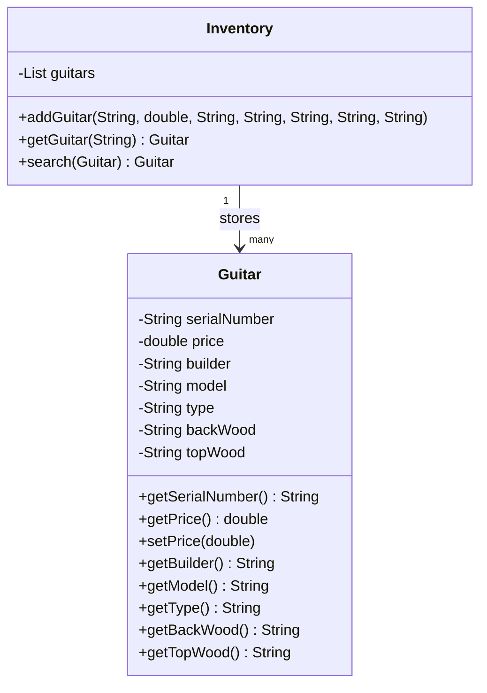
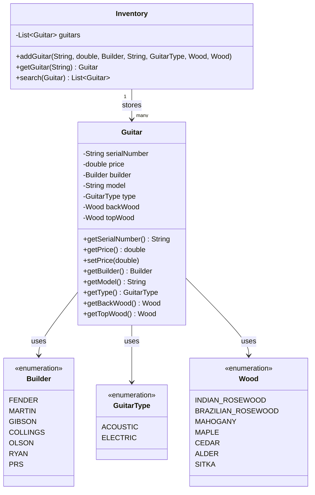
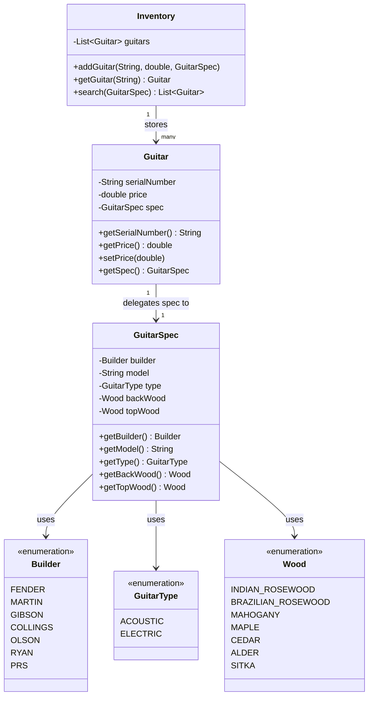
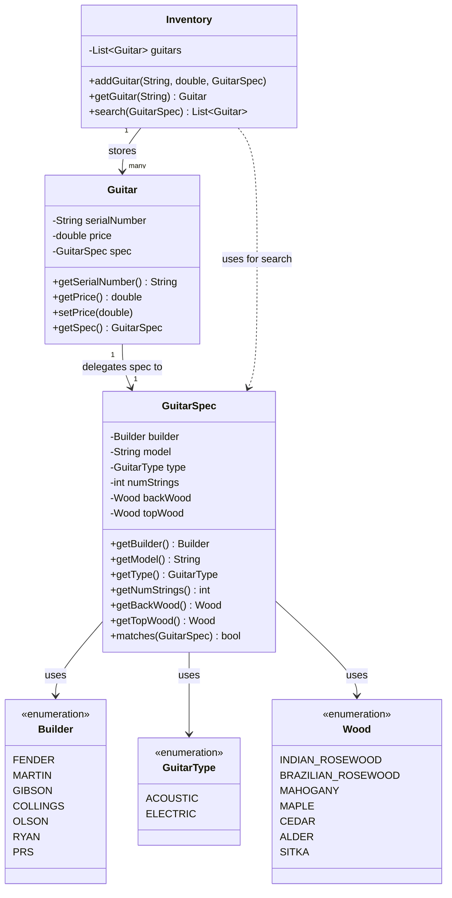

# 📖 Head First OOA&D — Chapter 1 Summary
## *Well-Designed Apps Rock*

> **Goal of this chapter:** Understand what "great software" really means, and learn a repeatable 3-step process to build it every single time.

---

## 🗺️ Chapter Overview

Chapter 1 kicks off with a real-world scenario: **Rick**, the owner of a high-end guitar shop, hired a firm to build him an inventory search tool. The app looked fine on paper — it had classes, methods, a UML diagram — but it was **broken**. Customers couldn't find guitars that Rick *knew* he had in stock.

The chapter walks you through diagnosing, fixing, and redesigning Rick's app using **Object-Oriented Analysis and Design (OOA&D)**. By the end, you'll have a clear mental framework for writing software that:

- Actually does what the customer wants
- Is flexible and easy to change
- Is well-designed and reusable

---

## 🎸 The Story: Rick's Guitar Shop

Rick runs a shop called **Rick's Guitars**. He replaced his paper-based system with a computer app built by a firm called *Down and Dirty Coding*. The app had two classes:

- **`Guitar`** — stores serial number, price, builder, model, type, and wood info
- **`Inventory`** — holds a list of guitars and provides a `search()` method

**The problem?** When customer Erin came in looking for a *Fender Stratocastor* guitar, the search returned nothing — even though Rick *had* the exact guitar she wanted.

The bug was simple but revealing: the inventory stored `"fender"` (lowercase), but the search compared it to `"Fender"` (capitalized). A string-casing mismatch caused a real business failure.

> 💡 **The lesson:** It's not enough for code to *look* correct. It must **work** correctly for the customer.

---

## 🗂️ Class Diagram — Version 1: The Original Broken Design

Everything crammed into two classes. `Guitar` holds both unique info **and** spec info. Raw String properties everywhere — a recipe for bugs.



**Problems with this design:**
- All properties are raw `String` — case mismatch bugs are guaranteed
- `search()` takes a whole `Guitar` object just to compare specs — wrong tool for the job
- `search()` returns only **one** result — what if multiple guitars match?
- No separation between "what makes a guitar unique" vs "what a customer searches by"

---

## 🤔 What Does "Great Software" Actually Mean?

The chapter asks this directly, and presents three perspectives:

| Perspective | Definition |
|---|---|
| 🙋 Customer-focused | Software always does what the customer wants, even in unexpected situations |
| 🧑‍💻 OO-focused | No duplicate code; every object controls its own behavior; easy to extend |
| 🧘 Design-guru | Uses proven patterns; objects are loosely coupled; open for extension, closed for modification |

**The chapter's answer:** All three matter. Great software must satisfy the customer *and* be well designed.

---

## 🪜 The 3 Steps to Great Software (Every Time)

This is the core framework of the chapter — and arguably the whole book:

```
Step 1 → Make sure your software does what the customer wants it to do.
           ↓
Step 2 → Apply basic OO principles to add flexibility.
           ↓
Step 3 → Strive for a maintainable, reusable design.
```

---

## 🔧 Step 1 — Make It Work (Pages 14–23)

Your **first job** is always to satisfy the customer. Don't worry about patterns or architecture yet. Get the basic functionality right first.

### Fix 1: Replace Strings with Enums

The root cause of the bug was raw `String` comparisons. The fix: use **enumerated types** so values are always valid — no spelling mistakes, no case issues.

```dart
enum Builder { fender, martin, gibson, collings, olson, ryan, prs }

enum GuitarType { acoustic, electric }

enum Wood {
  indianRosewood,
  brazilianRosewood,
  mahogany,
  maple,
  cedar,
  alder,
  sitka,
}
```

### Fix 2: Return a List of Results

Rick's original `search()` returned only **one** guitar. But what if he has two matching guitars? He loses a sale. The fix: return a `List<Guitar>`.

```dart
// ❌ Before — returns only one guitar, misses other matches
Guitar? search(Guitar searchGuitar) { ... }

// ✅ After — returns ALL matching guitars
List<Guitar> search(Guitar searchGuitar) { ... }
```

### Updated Guitar Class (After Step 1)

```dart
class Guitar {
  final String serialNumber;
  double price;
  final Builder builder;   // ✅ Enum — no more case bugs
  final String model;      // Still String — too many models to enumerate
  final GuitarType type;   // ✅ Enum
  final Wood backWood;     // ✅ Enum
  final Wood topWood;      // ✅ Enum

  Guitar(
    this.serialNumber,
    this.price,
    this.builder,
    this.model,
    this.type,
    this.backWood,
    this.topWood,
  );
}
```

### Updated Inventory Search (After Step 1)

```dart
List<Guitar> search(Guitar searchGuitar) {
  final matches = <Guitar>[];

  for (final guitar in _guitars) {
    if (searchGuitar.builder != guitar.builder) continue;

    // Model is still a String — use case-insensitive compare
    final model = searchGuitar.model;
    if (model.isNotEmpty &&
        model.toLowerCase() != guitar.model.toLowerCase()) continue;

    if (searchGuitar.type != guitar.type) continue;
    if (searchGuitar.backWood != guitar.backWood) continue;
    if (searchGuitar.topWood != guitar.topWood) continue;

    matches.add(guitar);
  }

  return matches;
}
```

> ✅ **Step 1 complete:** The app now works. Erin finds her guitar. Rick makes sales again.

---

## 🗂️ Class Diagram — Version 2: After Step 1 (Enums + List Return)



---

## 🧩 Step 2 — Apply OO Principles: Encapsulation (Pages 24–35)

The app works now, but there's a hidden design problem.

### The Problem: Mismatched Object Type

When a client calls `search()`, they pass a `Guitar` object — but a real customer **doesn't have a guitar**. They have **preferences** (builder, type, wood). Passing a full `Guitar` (with serial number, price, etc.) is the wrong object for a search request.

Also, `Guitar` holds **two responsibilities**:
1. Unique guitar data → `serialNumber`, `price`
2. Spec info that clients search by → `builder`, `type`, `wood`

This creates **duplicate logic** between `Guitar` and client search requests.

> 🎯 Rule: **Anytime you see duplicate code, look for a place to encapsulate.**

### The Fix: Extract GuitarSpec

Create a new `GuitarSpec` class that holds only the searchable properties. `Guitar` then holds a **reference** to a `GuitarSpec`.

```dart
class GuitarSpec {
  final Builder builder;
  final String model;
  final GuitarType type;
  final Wood backWood;
  final Wood topWood;

  GuitarSpec({
    required this.builder,
    required this.model,
    required this.type,
    required this.backWood,
    required this.topWood,
  });
}

class Guitar {
  final String serialNumber;
  double price;
  final GuitarSpec spec; // Guitar delegates spec responsibility

  Guitar(this.serialNumber, this.price, this.spec);

  GuitarSpec getSpec() => spec;
}
```

### Updated Inventory After Encapsulation

```dart
List<Guitar> search(GuitarSpec searchSpec) {
  final matches = <Guitar>[];

  for (final guitar in _guitars) {
    final guitarSpec = guitar.getSpec();

    if (searchSpec.builder != guitarSpec.builder) continue;

    final model = searchSpec.model;
    if (model.isNotEmpty &&
        model.toLowerCase() != guitarSpec.model.toLowerCase()) continue;

    if (searchSpec.type != guitarSpec.type) continue;
    if (searchSpec.backWood != guitarSpec.backWood) continue;
    if (searchSpec.topWood != guitarSpec.topWood) continue;

    matches.add(guitar);
  }

  return matches;
}
```

> ✅ **Step 2 complete:** `GuitarSpec` is now its own class. `Guitar`'s responsibilities are clear. The design is more flexible.

---

## 🗂️ Class Diagram — Version 3: After Step 2 (Encapsulation + GuitarSpec)



---

## ♻️ Step 3 — Strive for Reusable Design: Delegation + numStrings (Pages 36–53)

### The New Requirement

Rick comes back with a new feature request: he wants to sell **12-string guitars** and let customers search for them. This means adding `numStrings: int` to `GuitarSpec`.

### The Problem It Reveals

When `numStrings` is added to `GuitarSpec`, **two other classes break too**:

- `Guitar`'s constructor must be updated (it was constructing `GuitarSpec` properties individually)
- `Inventory`'s `search()` method needs a new comparison line for `numStrings`

This ripple effect across multiple classes is a classic sign of **tight coupling** — a fragile design.

> 🧠 **The insight:** `Inventory` shouldn't know *how* to compare two `GuitarSpec` objects. That's `GuitarSpec`'s own job. This is what **delegation** is for.

### The Fix: Move Comparison Logic into GuitarSpec via `matches()`

Give `GuitarSpec` a `matches()` method. Now `GuitarSpec` owns its own comparison logic — `Inventory.search()` just asks "do you match?" and moves on.

```dart
class GuitarSpec {
  final Builder builder;
  final String model;
  final GuitarType type;
  final int numStrings; // ✅ New property — added here ONLY
  final Wood backWood;
  final Wood topWood;

  GuitarSpec({
    required this.builder,
    required this.model,
    required this.type,
    required this.numStrings,
    required this.backWood,
    required this.topWood,
  });

  // ✅ GuitarSpec now owns its own comparison logic — this is delegation
  bool matches(GuitarSpec other) {
    if (builder != other.builder) return false;

    if (model.isNotEmpty &&
        model.toLowerCase() != other.model.toLowerCase()) return false;

    if (type != other.type) return false;
    if (numStrings != other.numStrings) return false; // ✅ New check — only here
    if (backWood != other.backWood) return false;
    if (topWood != other.topWood) return false;

    return true;
  }

  int getNumStrings() => numStrings;
}
```

### The Inventory search() Becomes Ultra Clean

Because `GuitarSpec` now handles its own comparison, `Inventory.search()` becomes beautifully simple:

```dart
List<Guitar> search(GuitarSpec searchSpec) {
  final matches = <Guitar>[];

  for (final guitar in _guitars) {
    // ✅ Delegate comparison to GuitarSpec — Inventory no longer compares fields
    if (guitar.getSpec().matches(searchSpec)) {
      matches.add(guitar);
    }
  }

  return matches;
}
```

> **Before:** 6 `if` statements in `Inventory.search()`, manually comparing every field
> **After:** 1 line — `guitar.getSpec().matches(searchSpec)`

This is **delegation** in its purest form.

### Guitar Constructor Also Gets Simpler

```dart
class Guitar {
  final String serialNumber;
  double price;
  final GuitarSpec spec;

  // ✅ Takes a GuitarSpec directly — doesn't need to know what's inside it
  Guitar(this.serialNumber, this.price, this.spec);

  GuitarSpec getSpec() => spec;
}
```

Now, if Rick ever adds another spec property (e.g., `numFrets`, `bodyShape`), you **only change `GuitarSpec`**. `Guitar` and `Inventory` don't need to change at all.

### Using the Final App

```dart
void main() {
  final inventory = Inventory();

  // Add 6-string and 12-string guitars
  inventory.addGuitar(
    'V95693', 1499.95,
    GuitarSpec(
      builder: Builder.fender,
      model: 'Stratocastor',
      type: GuitarType.electric,
      numStrings: 6,
      backWood: Wood.alder,
      topWood: Wood.alder,
    ),
  );

  inventory.addGuitar(
    'V9512', 1549.95,
    GuitarSpec(
      builder: Builder.fender,
      model: 'Stratocastor',
      type: GuitarType.electric,
      numStrings: 6,
      backWood: Wood.alder,
      topWood: Wood.alder,
    ),
  );

  inventory.addGuitar(
    'XB4321', 2100.00,
    GuitarSpec(
      builder: Builder.gibson,
      model: 'J-200',
      type: GuitarType.acoustic,
      numStrings: 12,
      backWood: Wood.maple,
      topWood: Wood.sitka,
    ),
  );

  // Erin is looking for a 6-string Fender electric
  final erinSpec = GuitarSpec(
    builder: Builder.fender,
    model: 'Stratocastor',
    type: GuitarType.electric,
    numStrings: 6,
    backWood: Wood.alder,
    topWood: Wood.alder,
  );

  final results = inventory.search(erinSpec);

  if (results.isEmpty) {
    print('Sorry, we have nothing for you.');
  } else {
    print('Erin, you might like these guitars:');
    for (final guitar in results) {
      final spec = guitar.getSpec();
      print(
        'We have a ${spec.builder.name} ${spec.model} '
        '${spec.numStrings}-string ${spec.type.name} guitar:\n'
        '  ${spec.backWood.name} back and sides\n'
        '  ${spec.topWood.name} top\n'
        '  Only \$${guitar.price}!\n'
        '----',
      );
    }
  }
}
```

> ✅ **Step 3 complete:** The app is now **robust**, **flexible**, and **reusable**. Adding new properties to `GuitarSpec` requires zero changes to `Guitar` or `Inventory`.

---

## 🗂️ Final Class Diagram — Version 4: The Complete Well-Designed System

This is the **end state** of all three design steps applied. Every class has one clear responsibility.



---

## 🔄 Design Evolution Summary

| Version | What Changed | Why |
|---|---|---|
| **V1 — Original** | 2 classes, raw Strings, `search()` returns one `Guitar` | Broken — case bugs, wrong return type |
| **V2 — Enums + List** | Replaced Strings with enums, `search()` returns `List<Guitar>` | Step 1: Make it work for the customer |
| **V3 — GuitarSpec** | Extracted spec into `GuitarSpec`, `Guitar` holds a reference | Step 2: Encapsulate what varies, remove duplicate code |
| **V4 — Delegation + numStrings** | Added `numStrings` to `GuitarSpec`, added `matches()`, `search()` delegates to `GuitarSpec` | Step 3: Reusable — adding new properties only touches one class |

---

## 🧩 Core Concepts Explained

### Encapsulation

**Encapsulation** means grouping related data and behavior together and isolating it from the rest of the app. Two flavors:

1. **Data protection** — making fields `private`
2. **Logical grouping** — extracting related properties into their own class (like `GuitarSpec`)

> 🎯 Rule: **Anytime you see duplicate code, look for a place to encapsulate.**

### Delegation

**Delegation** means letting one object hand off a responsibility to another object better suited for it.

In Rick's app: `Inventory.search()` used to manually compare every field of two `GuitarSpec` objects. After delegation, it simply calls `guitarSpec.matches(searchSpec)` and lets `GuitarSpec` handle the comparison.

> 🎯 Rule: **Each object should do its own job, and only its own job.**

### Loose Coupling

**Loosely coupled** classes are independent of each other's internals. In the final design:

- `Inventory` doesn't know what's inside `GuitarSpec`
- `Guitar` doesn't know how `GuitarSpec` compares itself
- Adding `numStrings` touches **only** `GuitarSpec`

### Fragile Code vs. Robust Code

| Fragile Code | Robust Code |
|---|---|
| String comparisons break on case differences | Enum comparisons — always exact |
| `search()` returns one result, misses duplicates | `search()` returns all matches |
| Adding a property changes 3 classes | Adding a property changes 1 class |
| Classes know too much about each other | Classes are loosely coupled |

### OOA&D

OOA&D is a practical approach to writing software that satisfies both the customer and the programmer. Four goals:

1. **Apps WORK** — do what the customer wants
2. **Apps KEEP WORKING** — robust, doesn't break on edge cases
3. **Apps can be UPGRADED** — adding features is easy and cheap
4. **Apps can be REUSED** — loosely coupled parts work in other contexts

> OOA&D is **not** about paperwork or fancy diagrams. It's about writing killer applications that leave your customer happy and your code maintainable.

---

## ✅ Key Takeaways

- **Start with the customer.** Get the app working before worrying about design patterns.
- **Enums beat strings.** When values are finite and known, use an enum — type-safe *and* value-safe.
- **Encapsulation is more than `private`.** It's about isolating what changes from what doesn't.
- **Duplicate code is a smell.** It signals a missing abstraction — find it and encapsulate it.
- **Delegation reduces coupling.** Let each object handle its own responsibilities.
- **`matches()` is the delegation pattern in action.** Moving comparison logic into the object being compared is clean, reusable, and extensible.
- **Adding a new property should only touch one class.** If it ripples across multiple classes, your design needs more encapsulation.
- **Don't over-engineer early.** Get functionality working first, then improve the design step by step.

---

## ⚠️ Common Mistakes & Misunderstandings

### ❌ Mistake 1: Jumping to patterns before the app works
The 3 steps exist for a reason: functionality first. Many developers try to architect before the app even does what the customer asked.

### ❌ Mistake 2: Treating encapsulation as just "make fields private"
Encapsulation is *also* about separating things that change from things that don't — like extracting `GuitarSpec` from `Guitar`.

### ❌ Mistake 3: Using strings for everything
Strings are flexible but dangerous for fixed-value properties. Use **enums** — they give you type safety and value safety at compile time.

### ❌ Mistake 4: Returning only one result when multiple make sense
Always think about what the customer actually needs. Rick might have two matching guitars — returning only one loses a sale.

### ❌ Mistake 5: Doing comparison logic in the wrong class
`Inventory.search()` originally compared all `GuitarSpec` properties manually — that's `GuitarSpec`'s job, not `Inventory`'s. Misplaced logic = tight coupling.

### ❌ Mistake 6: Thinking adding a property is "a small change"
If adding `numStrings` forces you to change `Guitar`, `Inventory`, AND `GuitarSpec`, your classes are too tightly coupled. Good design means a small change = touching one class.

---

## ❓ There's No Dumb Questions

**Q: Do I have to follow the 3 steps in exact order every time?**

A: Not strictly — they're guidelines, not a ritual. But the order protects you: don't spend days on architecture for software that doesn't do what the customer asked. Get it working, then improve.

---

**Q: Why use enums instead of just calling `.toLowerCase()` on strings?**

A: `toLowerCase()` fixes case bugs but doesn't prevent *misspellings* (`"fendder"`). An enum makes invalid values *impossible* at compile time — a far stronger guarantee.

---

**Q: What's the difference between encapsulation and delegation?**

A: Encapsulation groups related things into a class. Delegation means object A asks object B to handle a task B is better suited for. They work together: you encapsulate logic into `GuitarSpec`, then `Inventory` *delegates* comparison to it via `matches()`.

---

**Q: Why does `GuitarSpec` need a `matches()` method? Can't `Inventory` just compare the fields?**

A: It *can*, but then every time you add a field to `GuitarSpec`, you must also update `Inventory`. With `matches()`, `Inventory` is completely isolated — it just asks "do you match?" and doesn't care how the comparison works internally.

---

**Q: Why is `numStrings` an `int` and not an enum?**

A: Because there's no fixed, small set of possible string counts. A guitar could have 4, 6, 7, 8, or 12 strings. Enums work best when the set of values is known and limited. For open-ended numeric values, `int` is the right choice.

---

**Q: What is "loose coupling" and why does it matter?**

A: Loosely coupled classes don't depend on each other's internals. `Inventory` doesn't know *how* `GuitarSpec` compares itself — it just calls `matches()`. This means you can change `GuitarSpec` without breaking `Inventory`. Loose coupling = flexibility.

---

**Q: Is OOA&D only useful for large projects?**

A: Not at all. In Flutter, keeping your models (`GuitarSpec`), repositories (`Inventory`), and entities (`Guitar`) separate IS OOA&D in practice. Clean architecture in Flutter is OOA&D — the principles scale to any project size.

---

**Q: What does "robust code" actually mean in practice?**

A: Code that doesn't break when used in unexpected ways. After the refactor: enums make wrong input impossible, `matches()` centralizes comparison, and new properties only touch one class. That's robust.

---

## 📚 Key Terminology

| Term | Definition |
|---|---|
| **OOA&D** | Object-Oriented Analysis & Design — a practical approach to building software that satisfies customers and is well-structured |
| **Encapsulation** | Grouping related data/behavior together and isolating it; separating what changes from what doesn't |
| **Delegation** | When one object forwards a responsibility to another object better suited to handle it |
| **`matches()`** | A method on `GuitarSpec` that compares itself to another spec — the delegation pattern in action |
| **Fragile code** | Code that breaks easily when requirements change, due to tight coupling or duplicated logic |
| **Robust code** | Code that handles change gracefully |
| **Enumerated type (Enum)** | A type that restricts a variable to one of a fixed set of named constants |
| **Loose coupling** | When classes are independent of each other's internals — changes in one don't break others |
| **Tight coupling** | When classes depend heavily on each other — changing one forces changes in many others |
| **Duplicate code** | The same logic appearing in multiple places — signals a missing abstraction |
| **Type safety** | Compile-time guarantee that a variable holds a valid value of its declared type |
| **Value safety** | Guarantee that a variable can only hold a valid value — enums provide this |
| **Single Responsibility Principle (SRP)** | A class should have only one reason to change |
| **Open-Closed Principle (OCP)** | Code should be open for extension but closed for modification |

---

## 🏁 Chapter Summary

Chapter 1 establishes the **foundation for the entire book**. The central message:

> Writing great software isn't random. It's a repeatable process: make it work → make it flexible → make it reusable.

By the end of the chapter, Rick's broken search tool was transformed through **4 design versions** into a well-designed, extensible system:

- ✅ Returns **all** matching guitars (not just one)
- ✅ Uses **enums** to eliminate string casing bugs
- ✅ Uses **`GuitarSpec`** to encapsulate searchable properties away from `Guitar`
- ✅ Uses **`matches()`** so `GuitarSpec` owns its own comparison logic
- ✅ Supports **`numStrings`** — and any future property — by changing only `GuitarSpec`

That's OOA&D. That's great software. 🎸
