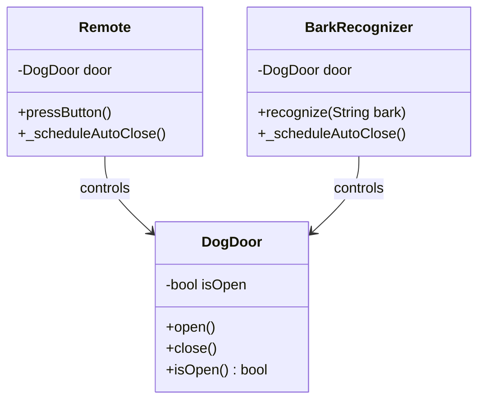
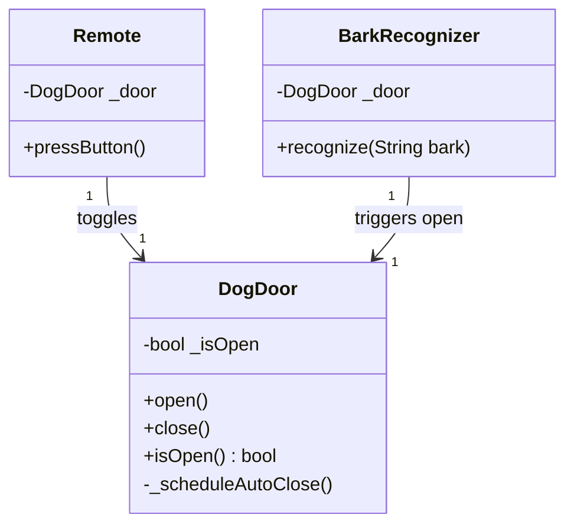

# 📖 Head First OOA&D — Chapter 3 Summary
## *Requirements Change: I Love You, You're Perfect... Now Change*

> **Goal of this chapter:** Understand that requirements *always* change, learn how to handle those changes gracefully using updated use cases and scenarios, and apply the first formal OO Design Principle: **Encapsulate what varies.**

---

## 🗺️ Chapter Overview

### What is this chapter about?

Chapter 3 picks up exactly where Chapter 2 left off — but with a twist. The dog door you built for Todd and Gina works perfectly... and then they call you on vacation to ask for changes.

This chapter answers the most honest question in software development:

> 🤔 **What do you do when the customer changes their mind?**

You'll learn that change isn't the enemy — *fragile code* is. If your design is solid, changes are cheap. If it isn't, even small requests become nightmares.

### Why it matters

In the real world, requirements never stay the same. Clients discover new needs. Businesses evolve. And your job as a developer isn't just to build what was asked — it's to build something that can **survive change**.

---

## 🎸 The Story: Todd and Gina Call Back

You just delivered a working dog door system. Doug's Dog Doors is selling over 10,000 units. Life is great.

Then Todd and Gina call:

> *"The door works great! But we're tired of listening for Fido all the time. Sometimes we don't even hear him bark. Can the door open automatically when Fido barks at it?"*

They also mention they keep losing the remote control.

So the new requirement is:

> **The dog door should open automatically when it detects Fido barking — without Todd or Gina pressing any button.**

---

## 🔁 The One Constant in Software

Before diving into the solution, the chapter hammers home a fundamental truth:

```
CHANGE
```

> No matter how well you design an application, it will always grow and change.
> Requirements change all the time — sometimes in the middle of a project, sometimes after delivery.
> **If you have good use cases, you can usually change your software quickly to adjust.**

This is the one constant in OOA&D that never goes away.

---

## 🔄 How to Handle Changing Requirements — The Process

The chapter introduces a clear workflow for dealing with change:

```
1. Customer asks for something new
        ↓
2. Update the Use Case first
        ↓
3. Update the Requirements List
        ↓
4. Write/update the code
        ↓
5. Test — including alternate paths
```

> ⚠️ **Never jump straight to the code.** Always update your use case first. Your use case will reveal what requirements need to change, and your requirements will guide what code to write.

---

## 📐 Updating the Use Case — Version 2.1 → 2.2 → 2.3

The chapter shows the use case evolving through several versions as Todd and Gina's requirements become clearer. This is a key insight: **use cases are living documents**.

---

### Use Case v2.1 — Adding Bark Recognition (First Attempt)

The initial attempt adds bark recognition as **alternate steps** inside the existing use case:

**Todd and Gina's Dog Door v2.1 — What the Door Does**

| Step | Action |
|---|---|
| 1 | Fido barks to be let out |
| 2 | Todd or Gina hears Fido barking |
| 2.1 | *The bark recognizer "hears" a bark* |
| 3 | Todd or Gina presses the button on the remote control |
| 3.1 | *The bark recognizer sends a request to the door to open* |
| 4 | The dog door opens |
| 5 | Fido goes outside |
| 6 | Fido does his business |
| 6.1 | The door shuts automatically |
| 6.2 | Fido barks to be let back inside |
| 6.3 | Todd or Gina hears Fido barking (again) |
| 6.3.1 | *The bark recognizer "hears" a bark (again)* |
| 6.4 | Todd or Gina presses the button on the remote control |
| 6.4.1 | *The bark recognizer sends a request to the door to open* |
| 6.5 | The dog door opens (again) |
| 7 | Fido goes back inside |
| 8 | The door shuts automatically |

**Problem:** This is confusing. The use case makes it look like Todd and Gina *always* hear the bark AND the recognizer sometimes also hears it. But that's wrong — it's **either** Todd/Gina pressing the remote **OR** the bark recognizer opening it automatically. Not both.

---

### Use Case v2.2 — Two Columns (Main Path + Alternate Paths)

The fix: separate the main path and alternate paths into **two columns** side by side, making it clear that steps on the right *replace* steps on the left when taken.

**Todd and Gina's Dog Door v2.2**

| Main Path | Alternate Paths |
|---|---|
| 1. Fido barks to be let out | |
| 2. Todd or Gina hears Fido barking | **2.1.** The bark recognizer "hears" a bark |
| 3. Todd or Gina presses the button on the remote | **3.1.** The bark recognizer sends a request to the door to open |
| 4. The dog door opens | |
| 5. Fido goes outside | |
| 6. Fido does his business | |
| 6.1. The door shuts automatically | |
| 6.2. Fido barks to be let back inside | |
| 6.3. Todd or Gina hears Fido barking (again) | **6.3.1.** The bark recognizer "hears" a bark (again) |
| 6.4. Todd or Gina presses the button on the remote | **6.4.1.** The bark recognizer sends a request to the door to open |
| 6.5. The dog door opens (again) | |
| 7. Fido goes back inside | |
| 8. The door shuts automatically | |

Now it's clear: at steps 2/3 and 6.3/6.4, you take **either** the left path **or** the right path — not both.

---

### Use Case v2.3 — The Final Version (Bark as Main Path)

**Excellent insight from the team:** Since Todd and Gina *mostly* want the bark recognizer to handle the door, the bark recognizer steps should be on the **main path**, and the remote control steps become the alternate path.

**Todd and Gina's Dog Door v2.3 — FINAL**

| Main Path | Alternate Paths |
|---|---|
| 1. Fido barks to be let out | |
| **2. The bark recognizer "hears" a bark** | 2.1. Todd or Gina hears Fido barking |
| **3. The bark recognizer sends a request to the door to open** | 3.1. Todd or Gina presses the button on the remote control |
| 4. The dog door opens | |
| 5. Fido goes outside | |
| 6. Fido does his business | |
| 6.1. The door shuts automatically | |
| 6.2. Fido barks to be let back inside | |
| **6.3. The bark recognizer "hears" a bark (again)** | 6.3.1. Todd or Gina hears Fido barking (again) |
| **6.4. The bark recognizer sends a request to the door to open** | 6.4.1. Todd or Gina presses the button on the remote control |
| 6.5. The dog door opens (again) | |
| 7. Fido goes back inside | |
| 8. The door shuts automatically | |

> ✅ **The main path should reflect what happens most of the time.** The remote control is the fallback — it stays in the alternate path.

---

## 🎯 Scenarios vs Use Cases — The Big Distinction

The chapter formalizes something important here:

> **A complete path through a use case — from first step to last — is called a Scenario.**

One use case can have **many scenarios**. Each scenario is just one specific way of walking through the use case. But all scenarios in the same use case share the **same customer goal**.

**Example:** Todd and Gina's door (v2.3) has 7 different scenarios:

| Scenario | Path Taken |
|---|---|
| 1 | 1, 2.1, 3.1, 4, 5, 6, 6.1, 6.2, 6.3.1, 6.4.1, 6.5, 7, 8 |
| 2 | 1, 2, 3, 4, 5, 6, 7, 8 *(no alternate paths)* |
| 3 | 1, 2.1, 3.1, 4, 5, 6, 7, 8 |
| 4 | 1, 2.1, 3.1, 4, 5, 6, 6.1, 6.2, 6.3, 6.4, 6.5, 7, 8 |
| 5 | 1, 2, 3, 4, 5, 6, 6.1, 6.2, 6.3.1, 6.4.1, 6.5, 7, 8 |
| 6 | 1, 2.1, 3.1, 4, 5, 6, 6.1, 6.2, 6.3.1, 6.4.1, 6.5, 7, 8 |
| 7 | 1, 2, 3, 4, 5, 6, 6.1, 6.2, 6.3, 6.4, 6.5, 7, 8 |

> 💡 Every scenario ends at **Step 8** — Fido is inside, door is closed. Same goal, different paths.

---

## 📋 Updating the Requirements List

Once the use case is updated, **go back and check your requirements**. The new scenarios revealed two requirements that weren't on the original list:

**Todd and Gina's Dog Door v2.3 — Final Requirements List:**

1. The dog door opening must be at least **12" tall**
2. A button on the remote control opens the door if closed, and closes it if open
3. Once the door has opened, it should close automatically if not already closed
4. ✅ **NEW:** A bark recognizer must be able to tell when a dog is barking
5. ✅ **NEW:** The bark recognizer must open the dog door when it hears barking

> 🎯 **Rule:** Any time you change your use case, you need to go back and check your requirements. A use case change often means a requirements change too.

---

## 💻 Dart Code Examples

### The BarkRecognizer Class

```dart
/// BarkRecognizer listens for barks and tells the door to open.
/// It holds a reference to the DogDoor — this is delegation in action.
/// BarkRecognizer's job: detect bark → open door. That's it.
class BarkRecognizer {
  final DogDoor _door;

  BarkRecognizer(this._door);

  /// Called by the hardware every time it detects a bark.
  /// The recognizer's only job: tell the door to open.
  void recognize(String bark) {
    print('BarkRecognizer: Heard a "$bark"');
    _door.open(); // Delegate the open action to DogDoor
  }
}
```

---

### The DogDoor Class — Now Closes Itself

This is the big design insight of Chapter 3. When `BarkRecognizer` was added, both `Remote` and `BarkRecognizer` needed to close the door — **duplicate code**. The fix: move the auto-close timer **into `DogDoor` itself**.

```dart
import 'dart:async';

/// DogDoor now manages its own auto-close behavior.
/// No matter WHAT opens the door (Remote, BarkRecognizer, or anything else
/// added in the future), the door will always close itself automatically.
/// This is the "Encapsulate what varies" principle in action.
class DogDoor {
  bool _isOpen = false;

  /// Opens the door and starts the auto-close timer.
  /// The closing logic lives HERE — not in Remote or BarkRecognizer.
  void open() {
    print('The dog door opens.');
    _isOpen = true;
    _scheduleAutoClose(); // ✅ Door closes itself — encapsulated!
  }

  /// Closes the door immediately.
  void close() {
    print('The dog door closes.');
    _isOpen = false;
  }

  bool get isOpen => _isOpen;

  /// Private — the door manages its own closing.
  /// No external class needs to know this exists.
  void _scheduleAutoClose() {
    Timer(const Duration(seconds: 5), () {
      if (_isOpen) {
        print('\n[Auto-close] The door shuts automatically.');
        close();
      }
    });
  }
}
```

---

### The Remote Class — Now Simplified

Because `DogDoor` handles closing itself, `Remote` no longer needs the timer code:

```dart
/// Remote — now much simpler.
/// It toggles the door open/closed. That's ALL it does.
/// The door handles its own auto-close. No duplicate code.
class Remote {
  final DogDoor _door;

  Remote(this._door);

  void pressButton() {
    print('Pressing the remote control button...');
    if (_door.isOpen) {
      _door.close(); // If open → close immediately
    } else {
      _door.open();  // If closed → open (door will auto-close itself)
    }
  }
}
```

---

### Full Simulator — Main Path (Bark Recognizer Opens the Door)

```dart
Future<void> main() async {
  final door = DogDoor();
  final recognizer = BarkRecognizer(door);
  final remote = Remote(door);

  // === MAIN PATH: Bark recognizer handles everything ===
  print('=== Scenario: Bark recognizer opens the door ===\n');

  // Step 1: Fido barks
  print('Fido starts barking...');

  // Steps 2–3: Bark recognizer hears it and opens the door
  recognizer.recognize('Woof'); // Door opens + auto-close timer starts

  // Step 5: Fido goes outside
  print('\nFido has gone outside...');
  print('Fido is doing his business...');

  // Step 6.1: Door auto-closes while Fido is outside
  await Future.delayed(const Duration(seconds: 6));
  // ...but he's stuck outside!
  print('\n...but he\'s stuck outside!');

  // Step 6.2–6.4: Fido barks again, recognizer opens the door again
  print('Fido starts barking again...');
  recognizer.recognize('Woof'); // Door opens again

  // Step 7: Fido comes back inside
  print('\nFido\'s back inside...');

  // Step 8: Door closes automatically
  await Future.delayed(const Duration(seconds: 6));
  print('Door is closed: ${!door.isOpen}');
}

// Output:
// === Scenario: Bark recognizer opens the door ===
// Fido starts barking...
// BarkRecognizer: Heard a "Woof"
// The dog door opens.
// Fido has gone outside...
// Fido is doing his business...
// [Auto-close] The door shuts automatically.
// ...but he's stuck outside!
// Fido starts barking again...
// BarkRecognizer: Heard a "Woof"
// The dog door opens.
// Fido's back inside...
// [Auto-close] The door shuts automatically.
// Door is closed: true
```

---

### Alternate Path — Remote Control Used Instead

```dart
Future<void> simulateAlternatePath() async {
  final door = DogDoor();
  final recognizer = BarkRecognizer(door);
  final remote = Remote(door);

  print('=== Alternate Scenario: Remote control used ===\n');

  // Steps 2.1 + 3.1: Todd hears Fido and presses remote
  print('Todd hears Fido barking...');
  remote.pressButton(); // Opens door + door auto-closes itself

  print('\nFido has gone outside...');
  print('Fido\'s all done...');

  // Door auto-closes
  await Future.delayed(const Duration(seconds: 6));
  print('\n...but he\'s stuck outside!');

  // 6.3.1 + 6.4.1: Gina hears and presses remote
  print('Fido starts barking...');
  print('Gina grabs the remote control.');
  remote.pressButton(); // Opens door again

  print('\nFido\'s back inside...');
  await Future.delayed(const Duration(seconds: 6));
  print('Done. Door is closed: ${!door.isOpen}');
}
```

---

## 🗂️ Class Diagram — Before and After

### ❌ Before (v2.2) — Duplicate Auto-Close Code



**Problem:** Both `Remote` and `BarkRecognizer` have `_scheduleAutoClose()` — the same timer code duplicated in two places. Adding any new way to open the door means copying the timer code again.

---

### ✅ After (v2.3) — Encapsulated, No Duplication



**What changed:**
- `_scheduleAutoClose()` moved **into `DogDoor`** — it's the only place that knows about it
- `Remote` and `BarkRecognizer` are now simpler and know nothing about the timer
- Any future class (e.g., `MotionSensor`, `SmartphoneApp`) can open the door without ever needing to handle the timer

---

## 🎯 The OO Design Principle Introduced in This Chapter

This chapter formally introduces the **first OO Design Principle** in the book:

```
╔══════════════════════════════════════════╗
║  OO PRINCIPLE                            ║
║                                          ║
║  Encapsulate what varies.                ║
╚══════════════════════════════════════════╝
```

### What does it mean?

Find the parts of your code that change or are likely to change — and **separate them from the parts that stay the same**.

In the dog door:
- **What varies:** How the door gets opened (remote, bark, future: motion sensor?)
- **What stays the same:** The door closes itself after 5 seconds

The solution: put the auto-close timer in `DogDoor`. Now no matter how many new opening mechanisms get added, they all get the auto-close behavior for free — without any code duplication.

## 🌍 Real-World Analogy

Think of a **smartphone.** When you buy a phone, you can unlock it with:
- A PIN
- Face ID
- Fingerprint
- Pattern

These are all different ways to "open" the phone. But no matter *how* you unlock it, the phone always does the same thing afterward: shows the home screen.

The **"show home screen"** behavior is encapsulated in the phone itself — not duplicated in Face ID AND fingerprint AND PIN separately.

That's **"Encapsulate what varies"** — the unlocking method varies, so each method handles its own logic. But what happens after unlocking is always the same — and it lives in one place.

---

## ✅ Key Takeaways

- **Change is the one constant in software.** Every project you work on will have changing requirements. Plan for it.
- **Always update the use case before updating the code.** The use case tells you what changed in the scenario, which tells you what requirements need updating, which tells you what code to write.
- **A scenario is one complete path through a use case.** One use case = many possible scenarios. All scenarios share the same customer goal.
- **The main path should reflect what happens most often.** If bark recognition is the primary way the door opens, it belongs on the main path — not as an alternate.
- **Alternate paths are optional sub-steps** that either add extra actions or provide a completely different way to achieve the same step — but they always rejoin the main path.
- **Duplicate code is a design smell.** If two classes have the same logic, find the right place to put it once.
- **Encapsulate what varies.** If a behavior might change or be triggered from multiple places, encapsulate it in the class it belongs to — not in every class that uses it.
- **Change reveals hidden problems.** Adding the BarkRecognizer revealed that the original door design had the auto-close logic in the wrong place. Sometimes a change request is actually doing you a favor.
- **Good design makes change cheap.** The better your encapsulation, the less code you need to touch when requirements change.

---

## ⚠️ Common Mistakes & Misunderstandings

### ❌ Mistake 1: Jumping to code when requirements change
The natural instinct is to open your editor and start coding. Resist it. Go back to the use case first, update the scenarios, then update requirements. The code comes last.

### ❌ Mistake 2: Treating all paths as alternate paths
Not every deviation is an "alternate path." If bark recognition is what happens *most of the time*, it's the **main path**. The remote control is the fallback. Your use case should reflect reality, not just the order in which features were built.

### ❌ Mistake 3: Putting auto-close code in every class that opens the door
This is the classic duplicate code mistake. If `Remote` closes the door, and `BarkRecognizer` also closes the door, you now have two places to maintain the same behavior. When the timer changes from 5 seconds to 10, you update it in two places — and forget one. Move it to `DogDoor`.

### ❌ Mistake 4: Confusing a scenario with a use case
A use case is the full set of steps and paths. A scenario is ONE specific route through those steps. If a customer says "let me show you what we want," they're usually walking you through a scenario — not the whole use case.

### ❌ Mistake 5: Never revisiting your use case after delivering code
The use case isn't a one-time document. It's a living artifact. Every time requirements change, your use case should change first. If your use case becomes outdated, it stops being useful.

### ❌ Mistake 6: Thinking "Encapsulate what varies" only means `private` fields
Encapsulation is bigger than access modifiers. It means isolating behavior that varies in its own class or method. The `DogDoor` auto-close isn't private — it's just in the right place.

---

## ❓ There's No Dumb Questions

**Q: Why do we need to update the use case before the requirements list?**

A: Because the use case shows you *how* the system is used — including the new scenarios created by the change. Once you see all the new scenarios, you can figure out what requirements are missing or need updating. Going straight to requirements without the use case often means you miss things.

---

**Q: What's the difference between an alternate path and a completely different use case?**

A: An alternate path is still part of the same use case — it still achieves the same customer goal. If Todd and Gina want a way to *track how many times* Fido goes outside (a different goal), that's a new use case. If they want a different way to *open the door* (same goal: Fido gets outside), that's an alternate path in the existing use case.

---

**Q: Can a use case have too many alternate paths?**

A: Yes, and when it does, the use case becomes confusing. The solution is to restructure it — put the most common path on the main path, and keep alternate paths truly optional. If a use case has 15+ alternate paths, consider whether some of them represent genuinely different goals (and should be separate use cases).

---

**Q: If "Encapsulate what varies" means putting logic in the right class, how do I know which class is "right"?**

A: Ask yourself: *"Whose job is this?"* The door always closes — so closing belongs to the door. The bark recognizer detects barks — so bark detection belongs there. Each class should be responsible for its own behavior. If a class is doing someone else's job, that's a sign something needs to move.

---

**Q: Is "Encapsulate what varies" only useful for avoiding duplicate code?**

A: No — it also makes your design more flexible. When the door closes itself, you can add a new way to open it (like a motion sensor) without touching the closing logic at all. Encapsulation reduces the number of places you need to change when requirements evolve.

---

**Q: What if the customer keeps changing requirements every week?**

A: That's the real world. This is exactly why use cases and the "encapsulate what varies" principle are so valuable. If your design isolates what varies, each change is localized — you touch one class, not ten. The key is to design for change from the start, not to resist change when it comes.

---

**Q: Should every class have just one responsibility?**

A: That's the **Single Responsibility Principle** — a close cousin of "Encapsulate what varies." The dog door chapter is a practical demonstration of it: `DogDoor` handles door state and auto-close. `Remote` handles button presses. `BarkRecognizer` handles bark detection. Each class has one clear job.

---

**Q: The BarkRecognizer opens the door for any dog that barks, not just Fido. Isn't that a bug?**

A: Yes! And the book actually points this out. It's a **future requirement hiding in plain sight**. The current code is simple and satisfies today's requirements. Fixing it (identifying *which* dog is barking) would be a new requirement — which would mean updating the use case, requirements list, and then the code. That's the cycle.

---

## 📚 Key Terminology

| Term | Definition |
|---|---|
| **Scenario** | One specific complete path through a use case — from the first step to the last stop condition |
| **Main Path** | The steps the system follows when everything goes as expected most of the time — the "happy path" |
| **Alternate Path** | Optional steps that either supplement the main path or provide a different way to accomplish a step — all alternate paths rejoin the main path |
| **Encapsulate what varies** | The OO Design Principle that says: separate the parts of your code that change from the parts that stay the same — put variable behavior in its own class or method |
| **Duplicate code** | The same logic appearing in more than one place — a maintenance nightmare and usually a sign that encapsulation is needed |
| **Bark Recognizer** | The new hardware/software component added in Chapter 3 that automatically detects dog barks and opens the door |
| **Living document** | A document (like a use case) that is updated as the system evolves — not written once and forgotten |
| **Requirements evolution** | The natural process of requirements changing and growing as customers learn more about what they need |
| **Single Responsibility** | Each class should have one clear job and one reason to change — closely related to "Encapsulate what varies" |

---

## 🗂️ Full Design Evolution — Chapter 3

| Version | Change | Why |
|---|---|---|
| **v2.0** (Ch. 2) | Basic door with remote + auto-close in `Remote` | Original working system |
| **v2.1** | Added bark recognizer steps as sub-steps mixed into the main path | First attempt — confusing |
| **v2.2** | Two-column format: main path on left, alternate paths on right | Clearer — but bark recognizer still on alternate path |
| **v2.3** | Bark recognizer promoted to **main path**, remote control becomes alternate | Matches reality — bark recognizer used most |
| **v2.3 + Refactor** | Auto-close timer moved from `Remote` into `DogDoor` — "Encapsulate what varies" | Eliminates duplicate code; any new opener gets auto-close for free |

---

## 🏁 Chapter Summary

Chapter 3 delivers two powerful lessons that every developer needs to internalize:

**Lesson 1:** Requirements always change. Your job isn't to prevent change — it's to design software that can *survive* change. The process: update use case → update requirements → update code.

**Lesson 2:** When you have duplicate code, something belongs somewhere else. The OO Design Principle **"Encapsulate what varies"** tells you to isolate variable behavior in the class that owns it.

By the end of the chapter, Todd and Gina's dog door evolved into a clean, flexible, three-class system:

- ✅ **`DogDoor`** — owns its own state AND auto-close behavior
- ✅ **`Remote`** — simple toggle, delegates everything to `DogDoor`
- ✅ **`BarkRecognizer`** — detects barks and asks `DogDoor` to open

And the design is now ready for whatever new "opener" Todd and Gina dream up next. 🐕