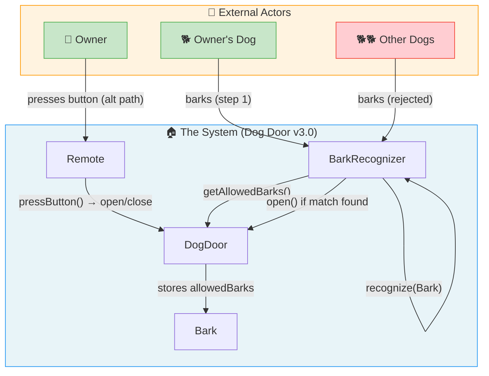
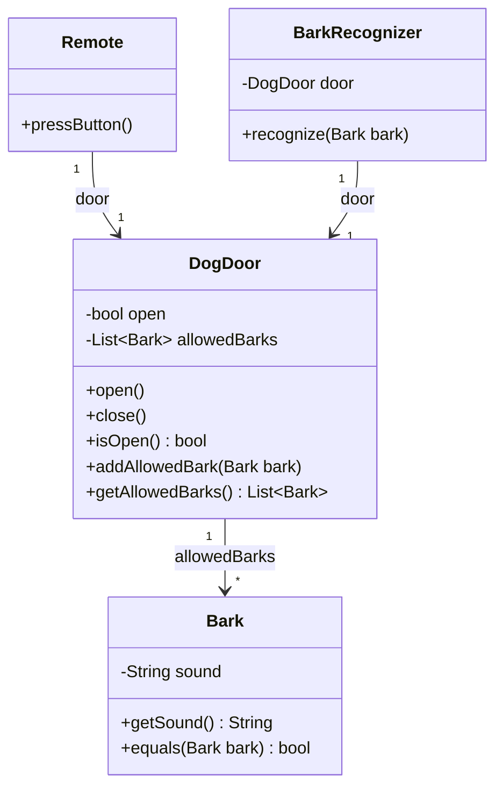

# 📖 Head First OOA&D — Chapter 4 Summary
## *Analysis: Taking Your Software into the Real World*

> **Goal of this chapter:** Learn how to make software that works in the **real world** — not just in a perfect, controlled test environment. Master **textual analysis** to derive classes and methods directly from your use cases, and understand how class diagrams communicate your design.

---

## 🗺️ Chapter Overview

### What is this chapter about?

Chapter 4 introduces a critical concept: **your software has a context**. Building something that works on your dev machine in a controlled test is easy. But the real world is messy — multiple dogs in a neighborhood, dogs that bark differently, unexpected inputs. The chapter teaches you how to **analyze** your system to discover these real-world problems before they hit your customers.

The central technique introduced is **Textual Analysis**: reading your use case like a detective, circling nouns to find candidate classes and verbs to find candidate methods.

### Why it matters

Without real-world analysis, you build software that solves the problem you *imagined*, not the one that actually exists. Randy and Sam built dog doors that worked in testing — but Maria won the contest by asking: *"What happens in the real world?"*

---

## 🐕 The Story: Holly's Problem

After Chapter 3's bark recognizer success, sales are booming. But complaints start coming in:

> *"The door opens for ALL the neighborhood dogs — not just mine!"*

**Holly** has a dog named **Bruce**. Her new door with the bark recognizer opens perfectly for Bruce — but also opens for every other dog in the neighborhood that barks. Rats, rabbits, and squirrels are getting in again.

**The root cause:** The `BarkRecognizer` opens the door for *any* bark — it has no way to tell Bruce's bark from any other dog's bark.

> 💡 **The insight:** Software needs to work in the **real world** — not just in a perfect world where only one dog exists. **Analysis** is how you make sure of that.

---

## 🔍 What is Analysis?

**Analysis** = figuring out potential real-world problems with your system, and solving them *before* you ship.

> The key to making sure things work is **analysis**: figuring out potential problems, and then solving those problems *before* you release your app into the real world.

The process:
1. **Identify the problem** — what can go wrong in real use?
2. **Plan a solution** — update your use case to handle it
3. **Update requirements** — make sure the solution is captured
4. **Write/update the code** — now that you know what you're building

---

## 🆕 The New Use Case — "Storing a Dog's Bark"

Analysis reveals a missing piece: to check if a bark belongs to the owner's dog, you need to **store** the owner's dog's bark somewhere. That's a whole new use case — a different goal from "let the dog outside."

**Use Case: Storing a Dog Bark**

| Step | Action |
|---|---|
| 1 | The owner's dog barks "into" the dog door |
| 2 | The dog door stores the owner's dog's bark |

**This is a separate use case because:**
- The goal is different (storing bark data vs. getting the dog outside)
- Different goals = different use cases
- You can't store a dog inside a dog door — it needs to be a software representation of what the dog sounds like

---

## 📐 The Final Use Case — "The Ultimate Dog Door v3.0"

This is the fully updated use case that handles real-world multi-dog environments:

**The Ultimate Dog Door, version 3.0 — Opening/Closing the Door**

| Main Path | Alternate Paths |
|---|---|
| 1. The owner's dog barks to be let out | |
| 2. The bark recognizer "hears" a bark | 2.1. The owner hears her dog barking |
| **3. If it's the owner's dog barking, the bark recognizer sends a request to the door to open** | 3.1. The owner presses the button on the remote control |
| 4. The dog door opens | |
| 5. The owner's dog goes outside | |
| 6. The owner's dog does his business | |
| 6.1. The door shuts automatically | |
| 6.2. The owner's dog barks to be let back inside | |
| 6.3. The bark recognizer "hears" a bark (again) | 6.3.1. The owner hears her dog barking (again) |
| **6.4. If it's the owner's dog barking, the bark recognizer sends a request to the door to open** | 6.4.1. The owner presses the button on the remote control |
| 6.5. The dog door opens (again) | |
| 7. The owner's dog goes back inside | |
| 8. The door shuts automatically | |

> **Key change in Step 3:** We changed "the bark recognizer sends a request to the door to open" to **"IF it's the owner's dog barking"** — this one word change reveals the entire real-world problem and its solution.

---

## 🔬 Textual Analysis — The Core Technique

**Textual Analysis** is the process of reading your use case text carefully, identifying the nouns and verbs, and using them to discover the classes and methods you need.

```
╔═══════════════════════════════════════════════════════╗
║                                                       ║
║   Nouns  in your use case → Candidate CLASSES         ║
║   Verbs  in your use case → Candidate METHODS         ║
║                                                       ║
╚═══════════════════════════════════════════════════════╝
```

### Step 1: Circle Every Noun

Read through the use case and circle every noun (person, place, thing):

**Nouns found in "The Ultimate Dog Door v3.0":**

| Noun | Class? | Notes |
|---|---|---|
| **owner's dog** | ❌ No class | Dog is *external* to the system — an actor |
| **bark recognizer** | ✅ `BarkRecognizer` | Core system component |
| **bark** | ✅ `Bark` | Needs a class to represent the sound |
| **dog door** | ✅ `DogDoor` | Core system component |
| **remote control** | ✅ `Remote` | Core system component |
| **owner** | ❌ No class | External actor — `Remote` handles owner interaction |
| **button** | ❌ No class | Part of `Remote` — already handled by `pressButton()` |
| **request** | ❌ No class | This is `BarkRecognizer` calling `door.open()` |
| **inside/outside** | ❌ No class | Physical locations — outside the software system |

> 🎯 **Key insight:** Not every noun becomes a class. You only need classes for things **your software has to represent and manage**. External actors, physical locations, and things already represented by other classes don't need their own class.

### Step 2: Circle Every Verb

Read through the use case and identify every verb action:

**Verbs → Methods mapping:**

| Verb phrase | Class | Method |
|---|---|---|
| "hears" a bark | `BarkRecognizer` | `recognize(Bark)` |
| sends a request to the door to open | `DogDoor` | `open()` |
| the door opens | `DogDoor` | `open()` |
| the door shuts automatically | `DogDoor` | `close()` |
| the owner presses the button | `Remote` | `pressButton()` |
| store the bark | `DogDoor` | `addAllowedBark(Bark)` |
| retrieve stored barks | `DogDoor` | `getAllowedBarks()` |

> 💡 **The verbs in your use case are usually the methods of the objects in your system.**

---

## 🏆 Randy vs Sam vs Maria — Three Approaches

The chapter uses a programming contest (winner gets a MacBook Pro!) to compare three different approaches to solving the "identify the dog" problem.

### Randy's Approach — Quick & Simple (String comparison)

Randy stores the dog's bark as a `String` in `DogDoor`:

```dart
// Randy's DogDoor — simple String storage
class DogDoor {
  bool _isOpen = false;
  String? _allowedBark; // Just a String

  void setAllowedBark(String bark) => _allowedBark = bark;
  String? getAllowedBark() => _allowedBark;
  // ... open(), close(), etc.
}
```

Randy's `BarkRecognizer` — simple String comparison:

```dart
// Randy's BarkRecognizer — String compare
class BarkRecognizer {
  final DogDoor _door;
  BarkRecognizer(this._door);

  void recognize(String bark) {
    print('BarkRecognizer: Heard a "$bark"');
    // Compare the bark heard to the bark stored in the door
    if (_door.getAllowedBark() == bark) {
      _door.open();
    } else {
      print('This dog is not allowed.');
    }
  }
}
```

**Randy's problem:** `"Rowlf"` ≠ `"Rowlf!"` ≠ `"ROWLF"` — one bark stored doesn't match every bark the dog makes.

---

### Sam's Approach — Object-Oriented (Bark class + delegation)

Sam creates a `Bark` class and delegates comparison to the `Bark` object itself:

```dart
// Sam's Bark class — the bark knows how to compare itself
class Bark {
  final String sound;

  Bark(this.sound);

  String getSound() => sound;

  @override
  bool operator ==(Object other) {
    if (other is! Bark) return false;
    return sound.toLowerCase() == other.sound.toLowerCase();
  }

  @override
  int get hashCode => sound.toLowerCase().hashCode;
}
```

Sam's DogDoor stores a single `Bark` object instead of a `String`:

```dart
// Sam's DogDoor — stores a Bark object
class DogDoor {
  bool _isOpen = false;
  Bark? _allowedBark;

  void setAllowedBark(Bark bark) => _allowedBark = bark;
  Bark? getAllowedBark() => _allowedBark;
  // ... open(), close(), etc.
}
```

**Sam's problem:** Still only stores ONE bark — dogs make different sounds!

---

### Maria's Approach — The Winner (Multiple barks + delegation)

Maria applied textual analysis properly. She focused on **"the owner's dog"** (a noun representing ALL the dog's sounds) — not just one particular bark.

**Maria's insight:** The use case says "if it's the owner's **dog** barking" — not "if it's this specific bark." A dog can bark in multiple ways. The door needs to store ALL the ways the dog can bark.

```dart
// Maria's Bark class — same as Sam's
class Bark {
  final String sound;
  Bark(this.sound);

  String getSound() => sound;

  bool equals(Bark other) {
    return sound.toLowerCase() == other.sound.toLowerCase();
  }
}
```

```dart
// Maria's DogDoor — stores MULTIPLE Bark objects (List<Bark>)
class DogDoor {
  bool _isOpen = false;
  final List<Bark> _allowedBarks = []; // ← Key insight: List, not single Bark

  /// Add a bark the owner's dog is allowed to use
  void addAllowedBark(Bark bark) {
    _allowedBarks.add(bark);
  }

  /// Get all allowed barks (represents the entire dog)
  List<Bark> getAllowedBarks() => List.unmodifiable(_allowedBarks);

  void open() {
    print('The dog door opens.');
    _isOpen = true;
    _scheduleAutoClose();
  }

  void close() {
    print('The dog door closes.');
    _isOpen = false;
  }

  bool get isOpen => _isOpen;

  void _scheduleAutoClose() {
    Future.delayed(const Duration(seconds: 5), () {
      if (_isOpen) close();
    });
  }
}
```

```dart
// Maria's BarkRecognizer — iterates through ALL allowed barks
class BarkRecognizer {
  final DogDoor _door;
  BarkRecognizer(this._door);

  void recognize(Bark bark) {
    print('BarkRecognizer: Heard a "${bark.getSound()}"');

    // Check this bark against ALL the barks the owner's dog can make
    final allowedBarks = _door.getAllowedBarks();
    for (final allowedBark in allowedBarks) {
      if (allowedBark.equals(bark)) {
        _door.open(); // ✅ It's the owner's dog — let them in!
        return;
      }
    }

    print('This dog is not allowed.');
  }
}
```

**Why Maria won:**
- She stored multiple barks → represents the whole dog, not one sound
- She delegated comparison to `Bark.equals()` → `BarkRecognizer` doesn't know how barks are compared
- She focused on the **dog** (the noun in the use case), not just the bark

---

## 🎯 Delegation Shields Your Objects

The chapter revisits **delegation** in the context of `Bark.equals()`:

> **Delegation shields your objects from implementation changes to other objects in your software.**

By delegating bark comparison to `Bark.equals()`, if you ever change how barks are compared (e.g., from String comparison to audio waveform matching), **only `Bark` needs to change** — `BarkRecognizer` stays the same.

```dart
// If bark comparison changes from String to audio fingerprint...
class Bark {
  final String sound;
  // Future: could add audioFingerprint, frequency, duration, etc.

  // BarkRecognizer calls this — it doesn't care HOW it works
  bool equals(Bark other) {
    // Today: simple string comparison
    return sound.toLowerCase() == other.sound.toLowerCase();
    // Future: could be audio fingerprint comparison
    // BarkRecognizer NEVER changes — only Bark changes
  }
}
```

---

## 🗂️ Class Diagrams — What They Show and What They Don't

The chapter dedicates significant time to teaching how to read and write class diagrams properly.

### UML Notation Explained

**Associations (lines between classes):**
- A solid line from one class to another = one class has an attribute of the other class's type
- The **label** on the line = the attribute name in the source class
- The **number** at the target end = multiplicity (how many can be held)

**Multiplicity symbols:**
- `1` = exactly one
- `*` = unlimited (zero or more)

**Example from the dog door:**
- `Remote` → `DogDoor` with label `door`, multiplicity `1` = Remote has one `DogDoor` attribute
- `DogDoor` → `Bark` with label `allowedBarks`, multiplicity `*` = DogDoor has a List of Bark objects

### What Class Diagrams DON'T Tell You

| What's missing | Why it matters |
|---|---|
| How methods are implemented | `recognize(Bark)` — what does it actually do? |
| Exact collection types | `allowedBarks: Bark[*]` — is it a `List`? `Set`? `Map`? |
| Constructor arguments | How do you create a `DogDoor`? |
| Business logic | When should the door open vs. stay closed? |
| Method implementations | The diagram says `open()` exists, not what it does |

> **Class diagrams give you a 10,000-foot view of your system.** The use case and requirements give you the rest of the story.

---

## 📐 Final Use Case Diagram (Mermaid)



---

## 🗂️ Final Class Diagram — Maria's Ultimate Dog Door

This is the complete, final class diagram for the dog door system after Chapter 4's analysis:



**Reading the diagram:**
- `Remote` and `BarkRecognizer` each hold **1** reference to `DogDoor` (via the `door` attribute)
- `DogDoor` holds **\*** (unlimited) `Bark` objects via the `allowedBarks` attribute
- When shown using association lines, the attribute name is written on the line, not in the class box — that's why `Remote` shows no attributes section (the `door` attribute is shown as the line label)

---

## 💻 Complete Dart Code — Final System

```dart
import 'dart:async';

// ════════════════════════════════════════════
// BARK — represents ONE sound a dog can make
// ════════════════════════════════════════════
class Bark {
  final String sound;

  Bark(this.sound);

  String getSound() => sound;

  /// Bark delegates its own comparison — BarkRecognizer doesn't need
  /// to know HOW barks are compared (delegation shields from change)
  bool equals(Bark other) {
    return sound.toLowerCase() == other.sound.toLowerCase();
  }

  @override
  String toString() => 'Bark("$sound")';
}

// ════════════════════════════════════════════
// DOG DOOR — core system hardware interface
// Stores allowed barks (represents the owner's dog)
// Manages its own auto-close (encapsulate what varies)
// ════════════════════════════════════════════
class DogDoor {
  bool _isOpen = false;
  final List<Bark> _allowedBarks = [];
  Timer? _closeTimer;

  void open() {
    print('The dog door opens.');
    _isOpen = true;
    _scheduleAutoClose();
  }

  void close() {
    print('The dog door closes.');
    _isOpen = false;
    _closeTimer?.cancel();
  }

  bool get isOpen => _isOpen;

  /// Register one of the ways the owner's dog can bark
  void addAllowedBark(Bark bark) {
    _allowedBarks.add(bark);
    print('[DogDoor] Registered allowed bark: ${bark.getSound()}');
  }

  /// Returns all the barks the owner's dog is allowed to use
  List<Bark> getAllowedBarks() => List.unmodifiable(_allowedBarks);

  void _scheduleAutoClose() {
    _closeTimer?.cancel();
    _closeTimer = Timer(const Duration(seconds: 5), () {
      if (_isOpen) {
        print('[Auto-close] The door shuts automatically.');
        close();
      }
    });
  }
}

// ════════════════════════════════════════════
// BARK RECOGNIZER — listens for barks and
// checks if it's the owner's dog
// ════════════════════════════════════════════
class BarkRecognizer {
  final DogDoor _door;

  BarkRecognizer(this._door);

  void recognize(Bark bark) {
    print('\nBarkRecognizer: Heard a "${bark.getSound()}"');

    // Get all the barks the owner's dog is allowed to make
    final allowedBarks = _door.getAllowedBarks();

    for (final allowedBark in allowedBarks) {
      // Delegate comparison to Bark — BarkRecognizer doesn't care HOW
      if (allowedBark.equals(bark)) {
        print('✅ It\'s the owner\'s dog!');
        _door.open();
        return;
      }
    }

    print('❌ This dog is not allowed.');
  }
}

// ════════════════════════════════════════════
// REMOTE — owner can manually toggle the door
// ════════════════════════════════════════════
class Remote {
  final DogDoor _door;

  Remote(this._door);

  void pressButton() {
    print('Pressing the remote control button...');
    if (_door.isOpen) {
      _door.close();
    } else {
      _door.open();
    }
  }
}

// ════════════════════════════════════════════
// SIMULATOR — runs the real-world scenario
// ════════════════════════════════════════════
Future<void> main() async {
  print('=== Setting up Holly\'s Dog Door v3.0 ===\n');

  final door = DogDoor();
  final recognizer = BarkRecognizer(door);
  final remote = Remote(door);

  // Use Case: Storing Bruce's bark (2nd use case)
  // Bruce can bark in multiple ways — register them ALL
  door.addAllowedBark(Bark('Rowlf'));
  door.addAllowedBark(Bark('Rowlf Rowlf'));
  door.addAllowedBark(Bark('Rooowlf'));

  print('\n=== Scenario 1: Bruce barks (main path) ===');
  recognizer.recognize(Bark('Rowlf')); // ✅ Bruce's bark — door opens

  await Future.delayed(const Duration(seconds: 6)); // Auto-close fires

  print('\n=== Scenario 2: Neighbor\'s dog barks (rejected) ===');
  recognizer.recognize(Bark('Yip Yip'));   // ❌ Not Bruce
  recognizer.recognize(Bark('Aroooo'));    // ❌ Not Bruce
  recognizer.recognize(Bark('Ruff Ruff')); // ❌ Not Bruce

  print('\n=== Scenario 3: Bruce barks in a different way ===');
  recognizer.recognize(Bark('Rooowlf')); // ✅ Also Bruce — door opens!

  await Future.delayed(const Duration(seconds: 6)); // Auto-close fires

  print('\n=== Scenario 4: Owner uses remote (alternate path) ===');
  remote.pressButton(); // ✅ Manual open

  await Future.delayed(const Duration(seconds: 6)); // Auto-close fires

  print('\nDone. Only Bruce got through. 🐕');
}
```

---

## ✅ Key Takeaways

- **Your software has a context.** Analysis means thinking about the real world your app will run in — not just the perfect scenario you imagined.
- **Textual analysis bridges use cases and code.** Circle the nouns → find candidate classes. Circle the verbs → find candidate methods. It's that straightforward.
- **Not every noun becomes a class.** External actors (like the dog), physical locations (inside/outside), and things already handled by other classes don't need their own class.
- **Words in use cases matter deeply.** "The bark recognizer opens the door" and "if it's the **owner's dog** barking, the recognizer opens the door" describe completely different systems. Focus on what the nouns are telling you.
- **Multiple barks = the dog.** A dog doesn't bark in just one way. Storing multiple `Bark` objects represents the whole dog's voice — this is what textual analysis revealed.
- **Delegation shields from change.** `BarkRecognizer` delegates bark comparison to `Bark.equals()`. If comparison logic changes, only `Bark` changes — nothing else does.
- **Class diagrams are 10,000-foot views.** They show what classes and methods exist, but not how methods work, what collection types are used, or what constructors look like. Use case + requirements fill those gaps.
- **Analysis helps you discover what you forgot.** The second use case ("Storing a dog bark") was invisible until analysis forced the question: *what are we comparing the bark against?*

---

## ⚠️ Common Mistakes & Misunderstandings

### ❌ Mistake 1: Only testing the happy path
Randy and Sam tested their doors and they worked. But they only tested with Bruce's bark in a controlled environment. Real analysis asks: what happens when neighbor dogs bark? What if Bruce barks differently?

### ❌ Mistake 2: Focusing on the wrong noun
Randy's Step 3 said "if the owner's dog's **bark** matches..." — he focused on a specific bark. The correct Step 3 says "if it's the owner's **dog**..." — the focus is on the dog, which can have multiple barks.

### ❌ Mistake 3: Assuming every noun needs a class
"The owner," "the button," "inside/outside," "request" — none of these became classes. External actors, physical concepts, and things already represented elsewhere don't need their own classes.

### ❌ Mistake 4: Skipping the second use case
Storing the dog's bark is a separate use case with a separate goal. Treating it as part of the main use case would mix two different goals. One use case = one goal.

### ❌ Mistake 5: Storing only one bark per dog
Dogs bark differently depending on mood, urgency, and situation. Storing only one sound means the door won't recognize most of the dog's actual barks. Store all of them.

### ❌ Mistake 6: Thinking class diagrams tell the whole story
Maria's class diagram shows `recognize(Bark)` in `BarkRecognizer`, but tells you nothing about how it iterates through `allowedBarks` or what happens when no match is found. You still need the use case to understand the system fully.

---

## ❓ There's No Dumb Questions

**Q: What's the difference between analysis and just writing more use cases?**

A: Analysis is the process of thinking critically about your system's context — anticipating real-world problems before they happen. Writing more use cases is one *output* of analysis. Analysis also changes existing use cases, updates requirements, and leads you to discover missing classes and methods.

---

**Q: How do I know which nouns become classes?**

A: You need classes only for things your *software has to represent and manage*. Ask: does your code need to store state about this noun? Does it have behavior? If yes — it's a class candidate. If the noun is external (like the dog owner), physical (like a location), or already handled by another class — skip it.

---

**Q: Why didn't Maria create a Dog class even though "dog" is a noun in the use case?**

A: Three reasons: the dog is external to the system (an actor, not part of the software), it's a living thing that doesn't map to a software object naturally, and you can't physically "store" a dog inside a door. Instead, the *collection of Bark objects* in `DogDoor` effectively represents the dog.

---

**Q: Is textual analysis perfect? Will it always find all my classes?**

A: No — it's a starting point, not a complete solution. Textual analysis finds candidates. You still apply judgment, domain knowledge, and common sense. Some nouns won't become classes; some classes won't come from nouns at all. But it's a fast, reliable way to get 80% of the way there.

---

**Q: Randy's solution was simpler. Isn't simpler better?**

A: Simple is great — but Randy's simplicity came at the cost of real-world correctness. A dog that barks "Rowlf!" one day and "Rowlf" the next wouldn't get through his door. Simple code that doesn't solve the actual problem isn't simple — it's wrong. Maria's solution is appropriately complex for the problem it solves.

---

**Q: Why is the `equals()` method on `Bark` instead of inside `BarkRecognizer`?**

A: Delegation. `BarkRecognizer` shouldn't need to know *how* two barks are compared — that's the `Bark` object's own business. This shields `BarkRecognizer` from future changes in comparison logic. If tomorrow barks are compared by audio frequency instead of strings, only `Bark` changes.

---

**Q: What does the `*` multiplicity mean in the class diagram?**

A: `*` means "zero or more" — an unlimited number. `allowedBarks: Bark[*]` means `DogDoor` can store any number of `Bark` objects. In Dart, this is usually implemented as `List<Bark>`, `Set<Bark>`, or similar.

---

**Q: In Flutter, when would I use textual analysis?**

A: Every time you write a use case or user story. Circle the nouns in your user stories — those are candidates for your data models, repositories, and services. Circle the verbs — those map to methods on those objects. It's the same process: a `UserProfile` entity, a `PostRepository`, a `NotificationService` — they all come from nouns in the stories.

---

## 📚 Key Terminology

| Term | Definition |
|---|---|
| **Analysis** | The process of identifying potential real-world problems with your system and solving them before release |
| **Textual Analysis** | Reading your use case to find candidate classes (nouns) and methods (verbs) |
| **Noun** | A person, place, or thing in your use case — a candidate for a class in your system |
| **Verb** | An action or behavior in your use case — a candidate for a method on a class |
| **Candidate class** | A noun from the use case that might become a class — needs judgment to confirm |
| **Multiplicity** | In UML, how many of a given type an attribute can hold (1 = one, * = unlimited) |
| **Association** | In a UML class diagram, a solid line connecting two classes, showing one holds a reference to the other |
| **Context** | The real-world environment your software runs in — with all its messiness and unexpected inputs |
| **Real world** | The environment outside your dev machine — multiple dogs, edge cases, unexpected inputs, varied conditions |
| **Delegation** | Letting one object hand off responsibility (like bark comparison) to another object better suited for it |
| **Class diagram** | A UML diagram showing classes, their attributes, methods, and relationships — a 10,000-foot view of your system |
| **Attribute** | A member variable of a class, shown in the top section of a class box in UML |
| **Operation** | A method of a class, shown in the bottom section of a class box in UML |

---

## 🏁 Chapter Summary

Chapter 4 delivers two connected lessons that take your software from "works in testing" to "works in the real world":

**Lesson 1 — Analysis:** Always ask what could go wrong in real-world use. The neighborhood dogs problem was never apparent until someone asked "but what about OTHER dogs?" That's analysis.

**Lesson 2 — Textual Analysis:** Your use case already contains your system's architecture. Circle the nouns → find the classes. Circle the verbs → find the methods. The words you choose in your use case *matter* — they shape your entire class design.

By the end of Chapter 4, the dog door evolved into a genuinely real-world-ready system:

- ✅ **`Bark`** — represents one sound a dog can make, owns its own comparison logic
- ✅ **`DogDoor`** — stores a `List<Bark>` (representing the whole dog), manages auto-close
- ✅ **`BarkRecognizer`** — compares any heard bark against ALL allowed barks, delegates comparison to `Bark`
- ✅ **`Remote`** — simple manual fallback, toggles the door

**Maria won the MacBook Pro** because she used textual analysis correctly — she focused on the *dog* (the noun), not just one *bark* (a particular sound). One word in a use case changed the entire design. 🐕