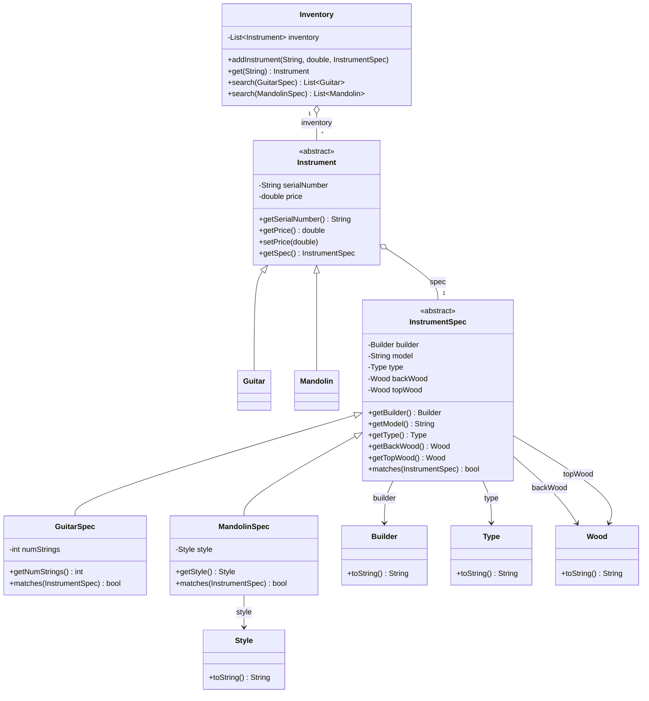
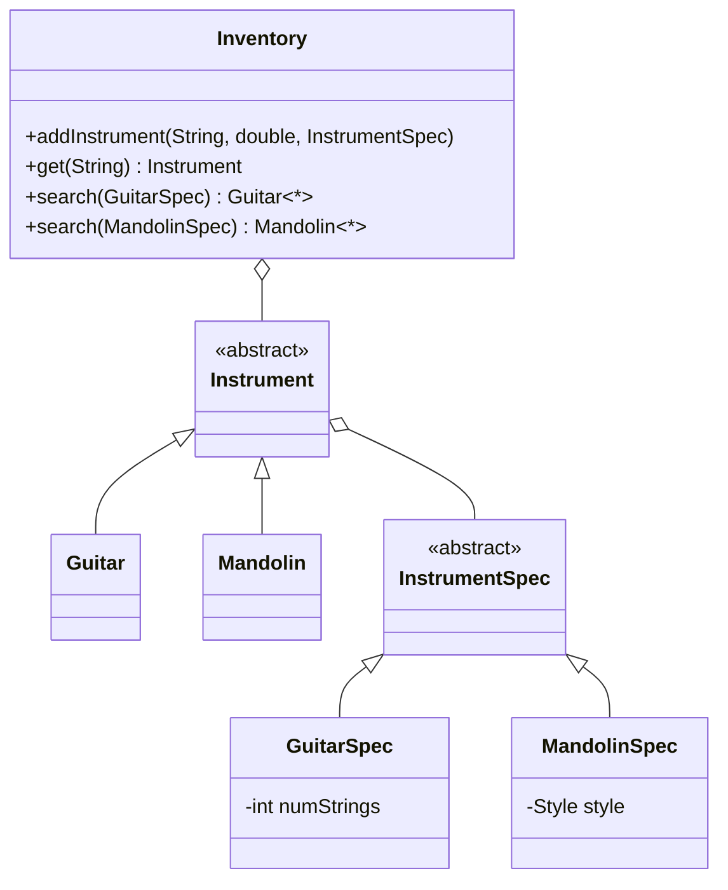
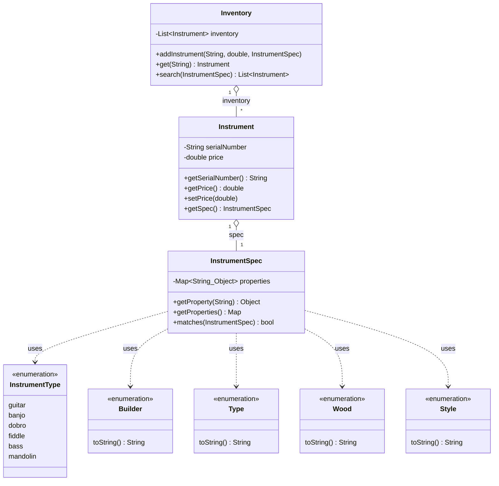

# 📖 Head First OOA&D — Chapter 5 Summary
## *Good Design = Flexible Software: Nothing Ever Stays the Same*

> **Goal of this chapter:** Take Rick's guitar search tool (from Chapter 1) and test how flexible it really is when the customer asks for new features. Build an abstract class hierarchy to support mandolins, learn the three most important OO Design Principles through OO Catastrophe, then ruthlessly tear that hierarchy back down in favor of a single flexible class driven by a property `Map` — arriving at **cohesion** and **loose coupling**, the hallmarks of truly great software.

---

## 🗺️ Chapter Overview — Part 1

### What is this chapter about?

Part 1 has two connected acts:

**Act 1 (pp. 197–219):** Rick's business is booming, and now he wants to sell **mandolins** in addition to guitars. We test the existing design by trying to add mandolins — and discover where it starts to crack. Abstract classes and inheritance to the rescue... but new problems emerge.

**Act 2 (pp. 220–232) — OO Catastrophe! :** Before we fix Rick's code, we pause for a game show that teaches three critical OO Design Principles — **Interface, Encapsulation,** and **Single Responsibility** — through memorable examples: Athlete teams, Painters, and Automobiles.

---

## 🎸 The Story: Rick's Guitars → Rick's Instruments

Rick has been selling guitars left and right using the search tool built in Chapter 1. Business is so good, he wants to expand:

> *"I want to start carrying mandolins, too. They're a lot like guitars — shouldn't be too hard to support, right?"*

**The challenge:** Add mandolin support without breaking the existing guitar search, and without duplicating code.

> 💡 **The real test of good design:** Can you change your software easily? If adding a new instrument type takes 30 minutes — great design. If it takes 3 days — bad design. Let's find out which one Rick's app is.

---

## 🔁 Step 1 — The First Attempt: Naive Approach

The instinctive move: add a `Mandolin` class and a `MandolinSpec` class alongside the existing `Guitar` and `GuitarSpec`.

**The MandolinSpec vs GuitarSpec — they're almost identical:**

| Property | GuitarSpec | MandolinSpec |
|---|---|---|
| builder | ✅ | ✅ |
| model | ✅ | ✅ |
| type | ✅ | ✅ |
| backWood | ✅ | ✅ |
| topWood | ✅ | ✅ |
| numStrings | ✅ | ❌ (mandolins always have 8) |
| **style** | ❌ | ✅ (A-style or F-style) |

Nearly everything is shared — just one property differs in each direction. This is a classic sign that **inheritance** is the right tool.

---

## 🧬 Abstract Classes — The Key Insight

### What is an Abstract Class?

An **abstract class** is a placeholder — it defines what all instruments (or all instrument specs) have in common, but you can never instantiate it directly.

```
╔══════════════════════════════════════════════════════╗
║  Abstract Class = Defines behavior, cannot be        ║
║                   instantiated.                      ║
║  Subclasses = Implement that behavior, can be        ║
║               instantiated.                          ║
╚══════════════════════════════════════════════════════╝
```

**In Dart:**
```dart
// Abstract class — no one creates an "Instrument" directly
// It's a placeholder for Guitar, Mandolin, Banjo, etc.
abstract class Instrument {
  final String serialNumber;
  double price;
  final InstrumentSpec spec;

  Instrument(this.serialNumber, this.price, this.spec);

  String getSerialNumber() => serialNumber;
  double getPrice() => price;
  void setPrice(double price) => this.price = price;
  InstrumentSpec getSpec() => spec;
}
```

```dart
// Concrete subclass — CAN be instantiated
class Guitar extends Instrument {
  Guitar(String serialNumber, double price, GuitarSpec spec)
      : super(serialNumber, price, spec);
}

class Mandolin extends Instrument {
  Mandolin(String serialNumber, double price, MandolinSpec spec)
      : super(serialNumber, price, spec);
}
```

Notice: `Guitar` and `Mandolin` only have constructors — all the real behavior lives in `Instrument`.

---

## 🧬 Abstract InstrumentSpec — Second Level of Abstraction

Since `GuitarSpec` and `MandolinSpec` share so many properties, we create a second abstract base class:

```dart
abstract class InstrumentSpec {
  final Builder builder;
  final String? model;
  final Type type;
  final Wood backWood;
  final Wood topWood;

  InstrumentSpec(this.builder, this.model, this.type,
                 this.backWood, this.topWood);

  Builder getBuilder() => builder;
  String? getModel() => model;
  Type getType() => type;
  Wood getBackWood() => backWood;
  Wood getTopWood() => topWood;

  // Subclasses override this to add instrument-specific comparisons
  bool matches(InstrumentSpec otherSpec) {
    if (builder != otherSpec.builder) return false;
    if (model != null && model!.isNotEmpty &&
        model!.toLowerCase() != otherSpec.model?.toLowerCase()) return false;
    if (type != otherSpec.type) return false;
    if (backWood != otherSpec.backWood) return false;
    if (topWood != otherSpec.topWood) return false;
    return true;
  }
}
```

```dart
// GuitarSpec only adds what's guitar-specific: numStrings
class GuitarSpec extends InstrumentSpec {
  final int numStrings;

  GuitarSpec(Builder builder, String? model, Type type,
             Wood backWood, Wood topWood, this.numStrings)
      : super(builder, model, type, backWood, topWood);

  int getNumStrings() => numStrings;

  @override
  bool matches(InstrumentSpec otherSpec) {
    if (!super.matches(otherSpec)) return false;
    if (otherSpec is! GuitarSpec) return false;
    return numStrings == otherSpec.numStrings;
  }
}

// MandolinSpec only adds what's mandolin-specific: style
class MandolinSpec extends InstrumentSpec {
  final Style style;

  MandolinSpec(Builder builder, String? model, Type type,
               Wood backWood, Wood topWood, this.style)
      : super(builder, model, type, backWood, topWood);

  Style getStyle() => style;

  @override
  bool matches(InstrumentSpec otherSpec) {
    if (!super.matches(otherSpec)) return false;
    if (otherSpec is! MandolinSpec) return false;
    return style == otherSpec.style;
  }
}
```

---

## 🗂️ UML Cheat Sheet — New Notation in Chapter 5

The chapter introduces three new UML relationship types:

| What we call it | UML name | How it looks in UML |
|---|---|---|
| Abstract Class | Abstract Class | *Italicized class name* |
| Relationship / reference | Association | `────────►` solid line with arrow |
| Inheritance / "extends" | Generalization | `──────────▷` hollow arrowhead |
| "Is made up of" | Aggregation | `◇──────────` diamond at source end |

### Aggregation vs Association

**Association:** One class *has a reference to* another class.
```
Instrument ────► InstrumentSpec    (Instrument HAS-A spec)
```

**Aggregation:** One class is *made up in part of* another class.
```
Instrument ◇──► InstrumentSpec    (Instrument is COMPOSED OF a spec)
```
Aggregation implies the whole is partly made up of its parts — the diamond goes on the "whole" side.

**Generalization (Inheritance):**
```
Guitar ──────▷ Instrument    (Guitar IS-A Instrument)
Mandolin ────▷ Instrument    (Mandolin IS-A Instrument)
```

---

## 🗂️ Class Diagram — Rick's App v2 (with Mandolin Support)



---

## 🧪 3 Steps to Great Software — How Does Rick's App Score?

The book revisits the 3-step checklist from Chapter 1:

| Step | Question | Answer for Rick's v2 |
|---|---|---|
| 1 | Does it do what the customer wants? | ✅ Mostly — finds guitars AND mandolins |
| 2 | Uses solid OO principles? | ✅ Yes — encapsulation, inheritance |
| 3 | Easy to reuse and extend? | ❌ **No** — still lots of work to add new types |

**The problem discovered:** When Rick says he also wants bass guitars, dobros, banjos, and fiddles — the design starts to fall apart:

- Every new instrument type needs a new `Instrument` subclass (e.g., `Banjo`, `Dobro`)
- Every new instrument type needs a new `InstrumentSpec` subclass (e.g., `BanjoSpec`)
- The `Inventory` class needs a new `search()` method for each type
- The `addInstrument()` method grows longer with every new `instanceof` check

This is **not** a flexible design. And that leads us to the next section.

---

## 🎮 OO Catastrophe! — The Game Show

Before fixing Rick's code, the chapter pauses to teach three critical OO principles through a Jeopardy-style game show. The host gives answers; you figure out the principle.

---

### 🏆 Principle 1: Code to an Interface, Not an Implementation

**Answer:** *"This code construct has the dual role of defining behavior that applies to multiple types, and also being the preferred focus of classes that use those types."*

**Question:** What is an **Interface**?

**The Athlete Example:**

```
// ❌ Coding to an IMPLEMENTATION — tight coupling
class Team {
  void addPlayer(BaseballPlayer player) { ... }
  // This only works with BaseballPlayer!
  // Add a hockey player? You need a new method.
}

// ✅ Coding to an INTERFACE — flexible
abstract class Athlete {
  String getSport();
  void play();
}

class Team {
  void addPlayer(Athlete player) { ... }
  // Works with ANY Athlete: Baseball, Hockey, Tennis, Cricket...
  // Even ones that don't exist yet!
}
```

> **Key insight:** When you code to an interface (or abstract class), your code works with **all** of the interface's subclasses — even ones that haven't been written yet.

**In Dart / Flutter terms:**
```dart
// ❌ Tight coupling — depends on specific implementation
class OrderScreen extends StatefulWidget {
  final FirebaseRepository repo; // only Firebase!
}

// ✅ Code to interface — loose coupling
abstract class OrderRepository {
  Future<List<Order>> getOrders();
  Future<void> saveOrder(Order order);
}

class OrderScreen extends StatefulWidget {
  final OrderRepository repo; // works with Firebase, SQLite, mock, anything!
}
```

---

### 🏆 Principle 2: Encapsulate What Varies

**Answer:** *"It's been responsible for preventing more maintenance problems than any other OO principle in history, by localizing the changes required for the behavior of an object to vary."*

**Question:** What is **Encapsulation**?

**The Painter Example:**

```
// ❌ paint() varies wildly — keeps changing inside Painter
class Painter {
  void prepareEasel() { ... }  // stable
  void cleanBrushes() { ... }  // stable
  void paint() { ... }         // varies — style changes constantly!
}

// ✅ Extract what varies into its own class
abstract class PaintStyle {
  String getStyle();
  void paint();
}

class ModernPaintStyle implements PaintStyle { ... }
class ImpressionistPaintStyle implements PaintStyle { ... }
class SurrealPaintStyle implements PaintStyle { ... }

class Painter {
  PaintStyle _style;
  Painter(this._style);

  void prepareEasel() { ... }
  void cleanBrushes() { ... }
  void paint() => _style.paint(); // delegates to the varying style
  void setPaintStyle(PaintStyle style) => _style = style;
}
```

Now when the painting style changes, only the `PaintStyle` implementation changes. `Painter` stays the same.

---

### 🏆 Principle 3: Each Class Should Have Only ONE Reason to Change (SRP)

**Answer:** *"Every class should attempt to make sure that it has only one reason to this, the death of many a badly designed piece of software."*

**Question:** What is **Change** / **Single Responsibility Principle**?

**The Automobile Example:**

```
// ❌ Automobile has MANY reasons to change
class Automobile {
  void start() { ... }
  void stop() { ... }
  void changeTires(List<Tire> tires) { ... }  // Mechanic logic
  void drive() { ... }                         // Driver logic
  void wash(Automobile car) { ... }            // CarWash logic
  void checkOil() { ... }                      // Mechanic logic
  int getOil() { ... }
}
// If how tires are changed changes → Automobile changes
// If how a car is driven changes → Automobile changes
// If how washing works changes → Automobile changes
// THREE different reasons to change = bad design
```

```dart
// ✅ Each class has ONE reason to change
class Automobile {
  void start() { }
  void stop() { }
  int getOil() => 0;
}

class Driver {
  void drive(Automobile car) { }
}

class CarWash {
  void wash(Automobile car) { }
}

class Mechanic {
  void checkOil(Automobile car) { }
  void changeTires(Automobile car, List<Tire> tires) { }
}
// Now each class changes for exactly ONE reason
```

---

## 🍦 Final Catastrophe — The Ice Cream Problem

The chapter ends OO Catastrophe with a full design problem to solve using all three principles. The bad design has a `DessertCounter` with methods for both `Cone` and `Sundae`, a `Syrup` subclassing `Topping`, and many `serve()` methods scattered everywhere.

**The fixes, applying all three principles:**

1. **DessertCounter has more than one reason to change** (ordering changes + topping changes) → SRP violation. Should code to the `Dessert` interface, not `Cone`/`Sundae` implementations.

2. **`Syrup` is an implementation of `Topping`** — `DessertCounter` shouldn't have an `addSyrup()` method specifically. Code to the `Topping` interface.

3. **`serve()` is duplicated** across `Dessert`, `IceCream`, `Topping`, and all subclasses → Encapsulate what varies. Pull `serve()` into a `DessertService` class.

---

## 📋 The 3 OO Principles — Summary Card

```
╔══════════════════════════════════════════════════════════════╗
║                    OO PRINCIPLES                             ║
╠══════════════════════════════════════════════════════════════╣
║                                                              ║
║  1. Encapsulate what varies.                                 ║
║     Find the parts likely to change — isolate them.         ║
║                                                              ║
║  2. Code to an interface, not an implementation.             ║
║     Program to abstract types / base classes, not           ║
║     concrete subclasses. Gain flexibility for free.         ║
║                                                              ║
║  3. Each class should have only ONE reason to change.        ║
║     If a class has multiple responsibilities, split it.     ║
║     High cohesion = one job, done really well.              ║
║                                                              ║
╚══════════════════════════════════════════════════════════════╝
```

---

## 💻 Complete Dart Code — Rick's App v2 (Part 1 Final State)

```dart
// ═══════════════════════════════════
// ENUMS
// ═══════════════════════════════════
enum Builder { collings, martin, gibson, fender, epiphoneone }
enum Type { acoustic, electric }
enum Wood { indianRosewood, brazilianRosewood, mahogany, maple,
            sitka, alder, adirondack, afrikaan, cherry }
enum Style { a, f } // Mandolin styles

// ═══════════════════════════════════
// ABSTRACT BASE: InstrumentSpec
// ═══════════════════════════════════
abstract class InstrumentSpec {
  final Builder builder;
  final String? model;
  final Type type;
  final Wood backWood;
  final Wood topWood;

  const InstrumentSpec(this.builder, this.model, this.type,
                       this.backWood, this.topWood);

  Builder getBuilder() => builder;
  String? getModel() => model;
  Type getType() => type;
  Wood getBackWood() => backWood;
  Wood getTopWood() => topWood;

  bool matches(InstrumentSpec other) {
    if (builder != other.builder) return false;
    if (model != null && model!.isNotEmpty &&
        model!.toLowerCase() != other.model?.toLowerCase()) return false;
    if (type != other.type) return false;
    if (backWood != other.backWood) return false;
    if (topWood != other.topWood) return false;
    return true;
  }
}

// ═══════════════════════════════════
// GuitarSpec
// ═══════════════════════════════════
class GuitarSpec extends InstrumentSpec {
  final int numStrings;

  const GuitarSpec(Builder builder, String? model, Type type,
                   Wood backWood, Wood topWood, this.numStrings)
      : super(builder, model, type, backWood, topWood);

  int getNumStrings() => numStrings;

  @override
  bool matches(InstrumentSpec other) {
    if (!super.matches(other)) return false;
    if (other is! GuitarSpec) return false;
    return numStrings == other.numStrings;
  }
}

// ═══════════════════════════════════
// MandolinSpec
// ═══════════════════════════════════
class MandolinSpec extends InstrumentSpec {
  final Style style;

  const MandolinSpec(Builder builder, String? model, Type type,
                     Wood backWood, Wood topWood, this.style)
      : super(builder, model, type, backWood, topWood);

  Style getStyle() => style;

  @override
  bool matches(InstrumentSpec other) {
    if (!super.matches(other)) return false;
    if (other is! MandolinSpec) return false;
    return style == other.style;
  }
}

// ═══════════════════════════════════
// ABSTRACT BASE: Instrument
// ═══════════════════════════════════
abstract class Instrument {
  final String serialNumber;
  double price;
  final InstrumentSpec spec;

  Instrument(this.serialNumber, this.price, this.spec);

  String getSerialNumber() => serialNumber;
  double getPrice() => price;
  void setPrice(double p) => price = p;
  InstrumentSpec getSpec() => spec;

  @override
  String toString() =>
      '${spec.runtimeType.toString().replaceAll("Spec", "")} '
      '[#$serialNumber] \$${price.toStringAsFixed(2)}';
}

// ═══════════════════════════════════
// Guitar and Mandolin subclasses
// ═══════════════════════════════════
class Guitar extends Instrument {
  Guitar(String serialNumber, double price, GuitarSpec spec)
      : super(serialNumber, price, spec);
}

class Mandolin extends Instrument {
  Mandolin(String serialNumber, double price, MandolinSpec spec)
      : super(serialNumber, price, spec);
}

// ═══════════════════════════════════
// INVENTORY
// Problem: needs separate search() for each instrument type
// This is what Part 2 will fix
// ═══════════════════════════════════
class Inventory {
  final List<Instrument> _inventory = [];

  void addInstrument(String serialNumber, double price,
                     InstrumentSpec spec) {
    Instrument instrument;
    if (spec is GuitarSpec) {
      instrument = Guitar(serialNumber, price, spec);
    } else if (spec is MandolinSpec) {
      instrument = Mandolin(serialNumber, price, spec);
    } else {
      throw ArgumentError('Unknown InstrumentSpec type');
    }
    _inventory.add(instrument);
  }

  Instrument? get(String serialNumber) {
    return _inventory
        .where((i) => i.getSerialNumber() == serialNumber)
        .firstOrNull;
  }

  // Separate search per instrument type — the problem we'll fix in Part 2
  List<Guitar> searchGuitars(GuitarSpec searchSpec) {
    return _inventory
        .whereType<Guitar>()
        .where((g) => g.getSpec().matches(searchSpec))
        .toList();
  }

  List<Mandolin> searchMandolins(MandolinSpec searchSpec) {
    return _inventory
        .whereType<Mandolin>()
        .where((m) => m.getSpec().matches(searchSpec))
        .toList();
  }
}

// ═══════════════════════════════════
// MAIN — Test Drive
// ═══════════════════════════════════
void main() {
  final inventory = Inventory();

  // Add some guitars
  inventory.addInstrument('11277', 3999.95,
      GuitarSpec(Builder.collings, 'CJ', Type.acoustic,
                 Wood.indianRosewood, Wood.sitka, 6));

  inventory.addInstrument('V95693', 1499.95,
      GuitarSpec(Builder.fender, 'Stratocastor', Type.electric,
                 Wood.alder, Wood.alder, 6));

  // Add some mandolins
  inventory.addInstrument('9019920', 5495.99,
      MandolinSpec(Builder.gibson, 'F-5G', Type.acoustic,
                   Wood.maple, Wood.maple, Style.f));

  // Search for guitars
  print('=== Searching for Gibson electric guitars ===');
  final guitarSearch = GuitarSpec(
      Builder.gibson, null, Type.electric,
      Wood.maple, Wood.maple, 6);
  final guitars = inventory.searchGuitars(guitarSearch);
  if (guitars.isEmpty) {
    print('No matching guitars found.');
  } else {
    for (final g in guitars) print('  Found: $g');
  }

  // Search for mandolins
  print('\n=== Searching for acoustic mandolins ===');
  final mandolinSearch = MandolinSpec(
      Builder.gibson, null, Type.acoustic,
      Wood.maple, Wood.maple, Style.f);
  final mandolins = inventory.searchMandolins(mandolinSearch);
  if (mandolins.isEmpty) {
    print('No matching mandolins found.');
  } else {
    for (final m in mandolins) print('  Found: $m');
  }
}
```

---

## ⚠️ Problems Not Yet Fixed

By the end of Part 1, Rick's app still has these issues:

1. **`addInstrument()` has instrument-specific `instanceof` checks** — grows with every new instrument type (Banjo, Dobro, Bass, Fiddle...)
2. **Separate `search()` method per instrument type** — `searchGuitars()`, `searchMandolins()`, `searchBanjos()`...
3. **Empty subclasses** — `Guitar` and `Mandolin` only have constructors. Is there really a need for separate subclasses just for that?
4. **`InstrumentSpec` subclasses add only one property each** — is all this inheritance really necessary, or is there a simpler way?

These problems are exactly what the second half of this chapter solves. 🚀

---

## 🗺️ Chapter Overview — Part 2

Part 2 is a workout. We take everything we learned in OO Catastrophe (the three OO principles) and ruthlessly apply them to Rick's app — even if it means throwing away design decisions we made earlier.

**The chapter has three phases:**

1. **Identify the remaining problems** in the Part 1 design
2. **Apply OO principles** to kill those problems one by one
3. **Validate the result** with the Ease-of-Change Challenge and understand **cohesion**

---

## 🩺 Back to Rick's App — The Remaining Problems

After Part 1, Rick's app looks like this:



**Problem 1 — `addInstrument()` has instrument-specific `instanceof` code:**

```dart
// Every new instrument type makes this longer and more fragile
void addInstrument(String serial, double price, InstrumentSpec spec) {
  if (spec is GuitarSpec) {
    inventory.add(Guitar(serial, price, spec as GuitarSpec));
  } else if (spec is MandolinSpec) {
    inventory.add(Mandolin(serial, price, spec as MandolinSpec));
  }
  // Add Banjo → add another else-if here
  // Add Dobro → add another else-if here
  // Never ends...
}
```

**Problem 2 — Separate `search()` method per instrument type:**
```dart
List<Guitar> search(GuitarSpec spec) { ... }
List<Mandolin> search(MandolinSpec spec) { ... }
List<Banjo> search(BanjoSpec spec) { ... }  // would need this too
// n instrument types = n search() methods
```

**Problem 3 — Empty subclasses that add nothing:**
```dart
// Guitar and Mandolin only have constructors
// They have no different behavior from Instrument
// So why do they exist?
class Guitar extends Instrument {
  Guitar(String sn, double price, GuitarSpec spec) : super(sn, price, spec);
}
```

**The root question:** Do we really need subclasses for each instrument type if they all behave the same? The answer from OO Catastrophe: **subclasses are for different behavior, not different properties.**

---

## 🔪 Fix 1: Kill the Instrument-Specific Subclasses

> **"Classes are about behavior. If the subclasses don't behave differently, you don't need them."**

In Rick's app, all instruments behave the same. A guitar doesn't `strum()`, a mandolin doesn't `pluck()` — those aren't in the design. The only difference is their **properties** (stored in their spec). Since properties are already handled by `InstrumentSpec` and its subclasses, the `Guitar` and `Mandolin` subclasses of `Instrument` serve no purpose.

**Solution:**
- Make `Instrument` a **concrete** (non-abstract) class
- Add an `InstrumentType` enum to identify the instrument type
- Delete `Guitar`, `Mandolin`, `Banjo`, `Dobro`, `Bass`, `Fiddle` subclasses — **6 classes gone**

```dart
// Before: needed a subclass for every instrument type
// After: one Instrument class handles everything
enum InstrumentType {
  guitar, banjo, dobro, fiddle, bass, mandolin;

  @override
  String toString() => name[0].toUpperCase() + name.substring(1);
}
```

```dart
// Now concrete — can be instantiated directly
class Instrument {
  final String serialNumber;
  double price;
  final InstrumentSpec spec;

  Instrument(this.serialNumber, this.price, this.spec);

  String getSerialNumber() => serialNumber;
  double getPrice() => price;
  void setPrice(double p) => price = p;
  InstrumentSpec getSpec() => spec;

  @override
  String toString() =>
    '${spec.getProperty("instrumentType")} '
    '[#$serialNumber] \$${price.toStringAsFixed(2)}';
}
```

---

## 🔪 Fix 2: Make InstrumentSpec Concrete → Single `search()` Method

Once `Instrument` is concrete and all instruments can be represented uniformly, we can make `InstrumentSpec` concrete too, and use one `search()` method that returns a mixed list of any matching instruments:

```dart
// Before: two separate search methods
List<Guitar> search(GuitarSpec spec) { ... }
List<Mandolin> search(MandolinSpec spec) { ... }

// After: ONE search method, returns any matching instruments
List<Instrument> search(InstrumentSpec searchSpec) {
  return _inventory
      .where((i) => i.getSpec().matches(searchSpec))
      .toList();
}
```

Now Rick's client can get back a guitar AND a mandolin AND a banjo in the same search result — if they all match the criteria.

But wait — we still have `GuitarSpec`, `MandolinSpec` subclasses of `InstrumentSpec`. And every new instrument type still requires a new spec subclass. The properties inside `InstrumentSpec` are what varies. We need one more layer of encapsulation...

---

## 🔪 Fix 3: "Double Encapsulation" — Use a `Map` for Properties

**Jill's insight (the key breakthrough of Part 2):**

> *"We encapsulate the spec properties away from Instrument into InstrumentSpec... but the properties INSIDE InstrumentSpec also vary across instrument types. We need another layer of encapsulation — encapsulate the properties themselves."*

**The solution:** Replace all individual properties in `InstrumentSpec` (builder, model, type, backWood, topWood, numStrings, style...) with a single `Map<String, Object>`.

```
╔════════════════════════════════════════════════════════════╗
║  Before: hardcoded properties in InstrumentSpec           ║
║    builder: Builder                                       ║
║    model: String                                          ║
║    type: Type                                             ║
║    backWood: Wood                                         ║
║    topWood: Wood                                          ║
║    numStrings: int   ← guitar-specific                   ║
║    style: Style      ← mandolin-specific                 ║
║                                                           ║
║  After: ONE Map holds everything dynamically             ║
║    properties: Map<String, Object>                       ║
║    { "instrumentType": InstrumentType.guitar,            ║
║      "builder": Builder.gibson,                          ║
║      "model": "Les Paul",                                ║
║      "type": Type.electric,                              ║
║      "backWood": Wood.maple,                             ║
║      "topWood": Wood.maple,                              ║
║      "numStrings": 6 }                                   ║
╚════════════════════════════════════════════════════════════╝
```

**Benefits:**
- No more `GuitarSpec` or `MandolinSpec` subclasses needed — **killed 4+ more classes**
- Adding a new instrument property (e.g., `neckWood`, `yearMade`) requires **zero class changes**
- Adding a new instrument type requires **zero new classes** — just add a new value to `InstrumentType`

---

## 🏗️ The Final Design — `InstrumentSpec` with Map

```dart
class InstrumentSpec {
  final Map<String, Object> _properties;

  InstrumentSpec(Map<String, Object>? properties)
      : _properties = properties != null
            ? Map<String, Object>.from(properties)
            : {};

  /// Get one property by name
  Object? getProperty(String propertyName) =>
      _properties[propertyName];

  /// Get all properties (read-only)
  Map<String, Object> getProperties() =>
      Map.unmodifiable(_properties);

  /// The core matching logic — generic and universal.
  /// For every property in otherSpec, check if this spec has it.
  /// If our spec doesn't have a property that otherSpec requires
  /// → no match.
  bool matches(InstrumentSpec otherSpec) {
    for (final propertyName in otherSpec._properties.keys) {
      if (_properties[propertyName] != otherSpec._properties[propertyName]) {
        return false;
      }
    }
    return true;
  }
}
```

**How `matches()` works:** The search spec only contains the properties the client cares about. `matches()` iterates through those properties and checks that this instrument spec has all of them with equal values. If a property is missing from the search spec, it's simply ignored — no constraint.

---

## 🏗️ The Final Inventory Class

```dart
class Inventory {
  final List<Instrument> _inventory = [];

  /// Now completely generic — no instanceof checks anywhere
  void addInstrument(String serialNumber, double price,
                     InstrumentSpec spec) {
    _inventory.add(Instrument(serialNumber, price, spec));
  }

  Instrument? get(String serialNumber) {
    return _inventory
        .where((i) => i.getSerialNumber() == serialNumber)
        .firstOrNull;
  }

  /// ONE search method, returns ALL matching instruments
  /// regardless of type — guitars, mandolins, banjos, whatever
  List<Instrument> search(InstrumentSpec searchSpec) {
    return _inventory
        .where((i) => i.getSpec().matches(searchSpec))
        .toList();
  }
}
```

---

## 💻 Complete Dart Code — Rick's Final Flexible App

```dart
// ═══════════════════════════════════════════════════
// ENUMS — these are the only things that change
// when Rick adds a new instrument type
// ═══════════════════════════════════════════════════
enum InstrumentType {
  guitar, banjo, dobro, fiddle, bass, mandolin;
  @override String toString() => name[0].toUpperCase() + name.substring(1);
}

enum Builder { collings, martin, gibson, fender, epiphoneone;
  @override String toString() => name[0].toUpperCase() + name.substring(1);
}

enum Type { acoustic, electric;
  @override String toString() => name[0].toUpperCase() + name.substring(1);
}

enum Wood { indianRosewood, brazilianRosewood, mahogany, maple,
            sitka, alder, adirondack, afrikaan, cherry;
  @override String toString() => name[0].toUpperCase() + name.substring(1);
}

enum Style { a, f;
  @override String toString() => name.toUpperCase();
}

// ═══════════════════════════════════════════════════
// INSTRUMENT SPEC — uses Map for all properties
// No subclasses needed anymore!
// ═══════════════════════════════════════════════════
class InstrumentSpec {
  final Map<String, Object> _properties;

  InstrumentSpec(Map<String, Object>? properties)
      : _properties = properties != null
            ? Map<String, Object>.from(properties)
            : {};

  Object? getProperty(String propertyName) => _properties[propertyName];

  Map<String, Object> getProperties() => Map.unmodifiable(_properties);

  bool matches(InstrumentSpec otherSpec) {
    for (final entry in otherSpec._properties.entries) {
      if (_properties[entry.key] != entry.value) return false;
    }
    return true;
  }
}

// ═══════════════════════════════════════════════════
// INSTRUMENT — one class for all instrument types
// No subclasses needed!
// ═══════════════════════════════════════════════════
class Instrument {
  final String serialNumber;
  double price;
  final InstrumentSpec spec;

  Instrument(this.serialNumber, this.price, this.spec);

  String getSerialNumber() => serialNumber;
  double getPrice() => price;
  void setPrice(double p) => price = p;
  InstrumentSpec getSpec() => spec;

  @override
  String toString() {
    final type = spec.getProperty('instrumentType') ?? 'Instrument';
    return '$type [#$serialNumber] \$${price.toStringAsFixed(2)}';
  }
}

// ═══════════════════════════════════════════════════
// INVENTORY — clean, generic, no instanceof checks
// ═══════════════════════════════════════════════════
class Inventory {
  final List<Instrument> _inventory = [];

  void addInstrument(String serialNumber, double price,
                     InstrumentSpec spec) {
    _inventory.add(Instrument(serialNumber, price, spec));
  }

  Instrument? get(String serialNumber) =>
      _inventory.where((i) => i.getSerialNumber() == serialNumber).firstOrNull;

  List<Instrument> search(InstrumentSpec searchSpec) =>
      _inventory.where((i) => i.getSpec().matches(searchSpec)).toList();
}

// ═══════════════════════════════════════════════════
// FIND INSTRUMENT — test class
// ═══════════════════════════════════════════════════
void main() {
  final inventory = Inventory();
  _initializeInventory(inventory);

  // Client wants a Gibson with maple back, doesn't care about type
  final properties = <String, Object>{
    'builder': Builder.gibson,
    'backWood': Wood.maple,
  };
  final clientSpec = InstrumentSpec(properties);

  final matchingInstruments = inventory.search(clientSpec);

  if (matchingInstruments.isEmpty) {
    print('Sorry, we have nothing for you.');
  } else {
    print('You might like these instruments:');
    for (final instrument in matchingInstruments) {
      final spec = instrument.getSpec();
      final type = spec.getProperty('instrumentType');
      print('\nWe have a $type with the following properties:');
      for (final entry in spec.getProperties().entries) {
        if (entry.key == 'instrumentType') continue;
        print('  ${entry.key}: ${entry.value}');
      }
      print('You can have this $type for \$${instrument.getPrice()}');
      print('---');
    }
  }
}

void _initializeInventory(Inventory inventory) {
  // GUITARS
  var props = <String, Object>{
    'instrumentType': InstrumentType.guitar,
    'builder': Builder.collings,
    'model': 'CJ',
    'type': Type.acoustic,
    'numStrings': 6,
    'topWood': Wood.sitka,
    'backWood': Wood.indianRosewood,
  };
  inventory.addInstrument('11277', 3999.95, InstrumentSpec(props));

  props = {
    'instrumentType': InstrumentType.guitar,
    'builder': Builder.gibson,
    'model': 'Les Paul',
    'type': Type.electric,
    'numStrings': 6,
    'topWood': Wood.maple,
    'backWood': Wood.maple,
  };
  inventory.addInstrument('70108276', 2295.95, InstrumentSpec(props));

  // MANDOLIN
  props = {
    'instrumentType': InstrumentType.mandolin,
    'builder': Builder.gibson,
    'model': 'F-5G',
    'type': Type.acoustic,
    'topWood': Wood.maple,
    'backWood': Wood.maple,
    'style': Style.f,
  };
  inventory.addInstrument('9019920', 5495.99, InstrumentSpec(props));

  // BANJO
  props = {
    'instrumentType': InstrumentType.banjo,
    'builder': Builder.gibson,
    'model': 'RB-3 Wreath',
    'type': Type.acoustic,
    'numStrings': 5,
    'backWood': Wood.maple,
  };
  inventory.addInstrument('8900231', 2945.95, InstrumentSpec(props));
}

// Output (searching for Gibson + maple back):
// You might like these instruments:
//
// We have a Guitar with the following properties:
//   builder: Gibson
//   model: Les Paul
//   type: Electric
//   numStrings: 6
//   topWood: Maple
//   backWood: Maple
// You can have this Guitar for $2295.95
// ---
// We have a Mandolin with the following properties:
//   builder: Gibson
//   model: F-5G
//   type: Acoustic
//   topWood: Maple
//   backWood: Maple
//   style: F
// You can have this Mandolin for $5495.99
// ---
// We have a Banjo with the following properties:
//   builder: Gibson
//   model: RB-3 Wreath
//   type: Acoustic
//   numStrings: 5
//   backWood: Maple
// You can have this Banjo for $2945.95
```

---

## 🗂️ Final Class Diagram



**Reading the diagram:**
- `Inventory` holds many `Instrument` objects (aggregation)
- `Instrument` holds one `InstrumentSpec` (aggregation)
- `InstrumentSpec` uses the enum types via its `Map` — no direct associations, loosely coupled
- **No subclasses anywhere** — the whole hierarchy has been flattened

---

## ⚡ The Ease-of-Change Challenge

To prove the design is truly flexible, the book runs a test: **add dobros and fiddles** to Rick's inventory.

**Before (Part 1 design):**
- Add `Dobro` class extending `Instrument` ← new class
- Add `DobroSpec` class extending `InstrumentSpec` ← new class
- Add `Fiddle` class extending `Instrument` ← new class
- Add `FiddleSpec` class extending `InstrumentSpec` ← new class
- Update `addInstrument()` with two new `instanceof` checks
- Add two new `search()` methods to `Inventory`
- **6+ changes across multiple files**

**After (Part 2 design):**
```dart
// That's it. Add the new types to the enum.
enum InstrumentType {
  guitar, banjo, dobro, fiddle, bass, mandolin; // ← already there!
}

// Then just add instruments to the inventory using a Map:
var props = <String, Object>{
  'instrumentType': InstrumentType.dobro,
  'builder': Builder.gibson,
  'model': 'Hound Dog',
  'type': Type.acoustic,
  'topWood': Wood.maple,
  'backWood': Wood.maple,
};
inventory.addInstrument('D-123', 1899.95, InstrumentSpec(props));
```

**Changes required:**
1. Add new values to `InstrumentType` enum → **1 change in 1 file**
2. Add instruments to inventory with a `Map` → **just data, no code changes**

| Scenario | Classes to add | Classes to change |
|---|---|---|
| Add a new instrument type (dobro) | **0** | **1** (just the enum) |
| Add a new property (yearMade) | **0** | **0** (just put it in the Map) |
| Add a new wood type | **0** | **1** (just the Wood enum) |

---

## 🏆 Design Wisdom from Part 2

The chapter closes with two unforgettable quotes:

> *"Most good designs come from analysis of bad designs. Never be afraid to make mistakes and then change things around."*

> *"Pride kills good design. Never be afraid to examine your own design decisions, and improve on them, even if it means backtracking."*

This is the story of the whole chapter: we *built* the abstract class hierarchy with Guitar, Mandolin, GuitarSpec, MandolinSpec in Part 1 — and then we **killed it all** in Part 2. That's not failure. That's the design life cycle.

---

## 🔬 Cohesion — The Final Concept

The chapter ends with the "Bureau de Change" character asking one question: **how cohesive is your software?**

### What is Cohesion?

> **Cohesion** measures the degree of connectivity among the elements of a single module, class, or object. The higher the cohesion, the more well-defined and related the responsibilities of each individual class.

**A cohesive class does ONE thing really well and does not try to do or be something else.**

Ask yourself: Do all the methods in a class relate to the class name? If you have a method that looks out of place, it probably belongs on another class.

### Cohesion in Rick's Final App

| Class | Job | Cohesive? |
|---|---|---|
| `Inventory` | Manage Rick's list of instruments — nothing else | ✅ High |
| `Instrument` | Store data about one instrument | ✅ High |
| `InstrumentSpec` | Store the specification properties for one instrument | ✅ High |
| `InstrumentType` | Name the types of instruments | ✅ High |

`Inventory` doesn't know *how* to compare instrument specs. `Instrument` doesn't know *how* to search. Each class has one well-defined job.

### Cohesion and Loose Coupling Go Together

> **The more cohesive your software is, the looser the coupling between classes.**

When each class does one thing, changes to one class don't cascade into others. In Rick's final app:
- Changing how specs are compared → only `InstrumentSpec.matches()` changes
- Adding a new instrument type → only the `InstrumentType` enum changes
- Adding a new property → only the calling code's `Map` changes

That's loose coupling. That's the goal.

### The Cohesion Journey in Rick's App

```
COHESION LEVEL (design evolution)

LOW  │  Ch. 1: Guitar + Inventory (2 classes, Guitar did too much)
     │
     │  Part 1 v1: Added abstract classes — better but still inflexible
     │
HIGH │  Part 2 FINAL: Instrument + InstrumentSpec(Map) + Enums
     │  High cohesion, loose coupling, easy to extend and reuse
```

> **Each time you make changes to your software, try to make sure you're getting MORE cohesive.**

### When to Stop

> *"Great software is usually about being good enough."*

There's no perfect design. Know when to stop:
1. ✅ The customer is happy — it does what it's supposed to do
2. ✅ The design is flexible — OO principles applied, easy to extend
3. ➡️ Move on to the next project

Spending hours chasing "perfect software" is wasted time. Delivering great software and moving on wins you more work, more promotions, and more respect.

---

## ⚠️ Common Mistakes

### ❌ Mistake 1: Creating subclasses for different properties instead of different behavior
If the only difference between `Guitar` and `Mandolin` is which properties their spec contains, you don't need subclasses. Store those properties in a `Map` and use an enum to identify the type.

### ❌ Mistake 2: Hardcoding instrument-specific fields in a spec class
Every field you add to `InstrumentSpec` for guitars (like `numStrings`) breaks open-closed: you have to change the class every time. A `Map` is open for new properties without touching the class.

### ❌ Mistake 3: Keeping bad designs out of pride
Once you realize a design decision was wrong (like abstract instrument subclasses that do nothing), delete it. Holding onto bad design because "it took effort to build" is pride-driven, not engineering-driven.

### ❌ Mistake 4: Confusing cohesion with simplicity
A class can be simple and still have low cohesion if its methods don't all relate to one focused job. And a class can be complex but highly cohesive. Cohesion is about **relatedness**, not line count.

### ❌ Mistake 5: Treating the design life cycle as linear
Design doesn't go: requirements → design → code → done. It goes: requirements → design → code → test → discover problems → redesign → code again → better design. Expect iteration. Welcome it.

---

## ❓ There's No Dumb Questions

**Q: Why do we need a separate `Instrument` class if it just holds a serial number, price, and spec?**

A: Because behavior may be added later, and because `Inventory` needs to store instruments without knowing their specific type. The `Instrument` class is the stable type that `Inventory` and `search()` work with — no `instanceof` checks required.

---

**Q: Doesn't using a `Map` lose type safety? Anyone can put anything in it.**

A: Yes, there's a trade-off. The original design had compile-time type checking (you couldn't pass a `Wood` where a `Builder` was expected). The `Map` trades that for flexibility. In practice, you can enforce conventions, write helper methods, or use typed keys to reduce errors. In Dart specifically, you'd likely use strong typing via `Map<String, dynamic>` and validate on insertion.

---

**Q: How do we know if a `Map` key exists vs. having a `null` value?**

A: Use `containsKey()` to check existence separately from `getProperty()`. This is important in `matches()` — a missing key is different from a key with a null value.

---

**Q: What happens in `matches()` when a property in the search spec doesn't exist in the instrument's spec?**

A: `matches()` returns `false`. If the search spec requires `numStrings: 6` and the instrument (a mandolin) has no `numStrings` key, they don't match — correct behavior. Mandolins won't show up in guitar searches.

---

**Q: Is "high cohesion = loosely coupled" always true?**

A: Almost always. When a class is highly cohesive (focused on one job), it needs fewer references to other classes — which means it's less coupled to them. There are edge cases, but the correlation is very strong in practice.

---

**Q: How does the design life cycle graph help in practice?**

A: It's a reminder that cohesion naturally goes down when you add features (you're tempted to put new behavior in existing classes), and your job as a developer is to refactor upward — split, extract, clean up — so cohesion keeps rising. Each feature addition is a risk. Each refactor is a recovery.

---

## ✅ Key Takeaways

- **Change is the true test of design.** If adding mandolins is easy, your design is good. If it triggers cascading changes everywhere, your design has problems.
- **Abstract classes are placeholders.** They define common behavior that subclasses implement. You can never instantiate them directly — and that's the point.
- **The abstract class defines the contract; the subclasses fulfill it.** `Instrument` says every instrument has a serial number and a price. `Guitar` and `Mandolin` say nothing new — they just inherit it.
- **Whenever you find common behavior in two or more places, abstract it.** This is what led to both `Instrument` and `InstrumentSpec` abstract base classes.
- **Code to an interface, not an implementation.** Write methods that take the base class/interface type, and they'll work with any subclass — even future ones.
- **Encapsulate what varies.** Move the parts that change into separate classes. The stable parts stay put; the variable parts can evolve independently.
- **Each class should have only ONE reason to change.** If a class does too many things, split it. The more focused a class is, the easier it is to change without breaking other things.
- **Good design is iterative.** Even the abstract class design we ended up with in Part 1 still has problems. Part 2 fixes them. Most good designs come from analyzing bad designs first.

- **Subclasses are for different behavior, not different properties.** If `Guitar` and `Mandolin` behave identically, you don't need separate classes — use an enum value to tell them apart.
- **When properties vary, use a `Map`.** Instead of adding new fields to a class (and subclasses) every time a new property appears, store all properties in a `Map<String, Object>`. Zero code changes for new properties.
- **One `search()` beats many `search()` methods.** By coding to the `InstrumentSpec` interface and using a generic `matches()`, you get a single search method that works for all instrument types — including ones not yet invented.
- **"Double encapsulation"** — if you encapsulate one level (spec away from instrument) but the things inside the spec still vary, you need another level (the map inside the spec).
- **Design is iterative.** The Part 1 design with abstract classes and subclasses seemed good at the time. Part 2 showed it was still inflexible. Good designs usually emerge from bad ones — that's the design life cycle.
- **Pride kills good design.** Never be afraid to throw away a design decision you made earlier. The willingness to backtrack is a sign of maturity, not weakness.
- **Cohesion = one class, one job.** If your class has methods that don't relate to the class name, those methods probably belong elsewhere. Each class should focus on ONE thing and do it really well.
- **High cohesion → loose coupling.** When each class does one thing, changes to one class don't ripple through others. This is the defining property of truly great, maintainable software.
- **Great software is good enough.** Know when to stop. Make the customer happy, make the design flexible, then ship it and move on.

---

## 📚 Key Terminology

| Term | Definition |
|---|---|
| **Abstract Class** | A class marked `abstract` that cannot be instantiated directly; defines behavior that subclasses must implement |
| **Concrete Class** | A non-abstract class that can be instantiated; provides actual implementations of all methods |
| **Subclass** | A class that `extends` another class, inheriting its attributes and methods |
| **Superclass** | The parent class that is extended by subclasses |
| **Inheritance** | The mechanism by which a subclass acquires all attributes and behavior of its superclass |
| **Generalization** | UML term for inheritance; shown with a hollow arrowhead (▷) |
| **Aggregation** | A UML relationship showing that one class is "made up of" another; shown with a diamond (◇) |
| **Association** | A general UML relationship showing one class has a reference to another; shown with a solid arrow (►) |
| **Interface** | In OO design, a type that defines behavior without implementing it; code to this, not to implementations |
| **Code to an interface** | Write code that uses the abstract type/interface, not a specific subclass — gaining flexibility |
| **Encapsulate what varies** | The OO principle of isolating behavior that changes into its own class, away from stable behavior |
| **Single Responsibility Principle (SRP)** | Each class should have only one reason to change — one focused job |
| **Cohesion** | How closely related all the responsibilities of a single class are; high cohesion means the class does one well-defined thing |
| **Loose coupling** | Objects are independent — changes to one don't require changes to others; the goal of good OO design |
| **Tight coupling** | Objects are highly dependent — changes ripple everywhere; usually a sign of poor encapsulation |
| **Design life cycle** | The iterative process of designing, coding, discovering problems, and redesigning — not a linear pipeline |
| **Dynamic properties** | Properties stored in a `Map` rather than individual fields; allows adding new properties without changing the class |
| **"Double encapsulation"** | Informal term for encapsulating at two levels: spec away from instrument, and individual properties away from spec |
| **Ease-of-change test** | A measure of design quality: how many classes must change (or be added) to support a new requirement? |
| **`Map<String, Object>`** | The Dart data structure used to store instrument properties dynamically; key = property name, value = property value |
| **`InstrumentType` enum** | Replaces the need for `Guitar`, `Mandolin`, `Banjo` etc. subclasses — just identifies what type of instrument it is |
| **Pride kills good design** | The book's warning: never refuse to revisit and improve a design decision, even if it means throwing away work |
| **Great software is good enough** | Know when to stop refining — customer happy + design flexible = ship it |
| **Open/Closed Principle** | Mentioned implicitly: classes should be open for extension but closed for modification; the `Map` approach achieves this for properties |

